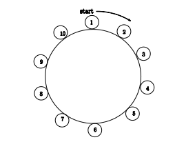

## 문제

자연수 1,2,3,...,n이 그림과 같이 증가하는 순서로 원을 만들고 있다. 창영이는 원에서 수를 하나씩 골라 수열을 만들려고 한다. 시작은 1번이다. 수에 수가 없을 때까지, k번째 수를 계속 선택해 원에서 제거하고, 수열에 추가한다. 이렇게 만든 수열을 Jump(n,k)라고 한다. (1 ≤ n,k)

Jump(10,2)의 처음 다섯 수는 2, 4, 6, 8, 10이다. 그 다음에는 3, 7, 1, 9, 5를 고를 수 있다. 따라서, Jump(10,2) = [2,4,6,8,10,3,7,1,9,5]이다. Jump(13,3) = [3,6,9,12,2,7,11,4,10,5,1,8,13]이고, Jump(13,10) = [10,7,5,4,6,9,13,8,3,12,1,11,2], Jump(10,19) = [9,10,3,8,1,6,4,5,7,2]이다.

n과 k가 주어졌을 때, Jump(n,k)의 마지막 세 숫자를 구하는 프로그램을 작성하시오. n=10, k=2인 경우 1,9,5를 출력하면 된다. Jump(1,k) = [1]이다.

## 입력

첫째 줄에 테스트 케이스의 개수 T가 주어진다. 각 테스트 케이스는 한 줄이고 두 자연수 n과 k가 주어진다. (5 ≤ n ≤ 500,000, 2 ≤ k ≤ 500,000)

## 출력

각 테스트 케이스에 대해서, 뒤에서 세 번째 수, 두 번째 수, 첫 번째 수를 공백으로 구분하여 출력한다.
