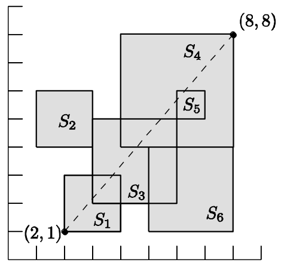

## 문제

The famous Korean IT company nhn plans to make a digital map of the Earth with help of wireless sensors which spread out in rough terrains. Each sensor sends a geographical data to nhn. But, due to the inaccuracy of the sensing devices equipped in the sensors, nhn only knows a square region in which each geographical data happens. Thus a geographical data can be any point in a square region. You are asked to solve some geometric problem, known as diameter problem, on these undetermined points in the squares.

A diameter for a set of points in the plane is defined as the maximum (Euclidean) distance among pairs of the points in the set. The diameter is used as a measurement to estimate the geographical size of the set. nhn wants you to compute the largest diameter of the points chosen from the squares. In other words, given a set of squares in the plane, you have to choose exactly one point from each square so that the diameter for the chosen points is maximized. The sides of the squares are parallel to X-axis or Y-axis, and the squares may have different sizes, intersect each other, and share the same corners.

For example, if there are six squares as in the figure below, then the largest diameter is defined as the distance between two corner points of squares S1 and S4 .

Given a set of n squares in the plane, write a program to compute the largest diameter D of the points when a point is chosen from each square, and to output D2, i.e., the squared value of D .

## 입력

Your program is to read from standard input. The input consists of T test cases. The number of test cases T is given in the first line of the input. The first line of each test case contains an integer, n , the number of squares, where 2 ≤ n ≤ 100,000 . Each line of the next n lines contains three integers, x , y , and w , where (x, y) is the coordinate of the left-lower corner of a square and w is the length of a side of the square; 0 ≤ x, y ≤ 10,000 and 1 ≤ w ≤ 10,000 .

## 출력

Your program is to write to standard output. Print exactly one line for each test case. The line should contain the integral value D2 , where D is the largest diameter of the points when a point is chosen from each square.

The following shows sample input and output for two test cases.
