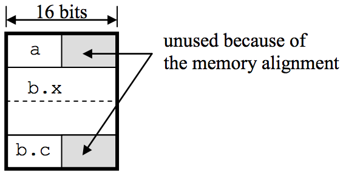

## 문제

Most high-level languages support structured data types. For example, Pascal has record types, C has struct types, and C++ and Java have class types. Structured types can have component types and a structured data should contain its component data.

We should consider the memory alignment when storing the structured data. In a traditional computer of Von Neumann architecture, the computer memory is referenced in the unit of words. Therefore, for the fast data access, all the data stored in the computer memory should be aligned in the unit of words. Generally, the size of a word is a multiple of bytes and the word size is fixed for a computer. Sometimes we call a computer by the word size, namely, W-byte computer, which means the size of words is W bytes.

Due to the memory alignment, memory fragmentation occurs. For instance, a data of 1-byte size consumes 4 bytes in a 4-byte computer. Generally, a data type T causes memory fragmentation unless the size of T is not a multiple of the word size. Let’s take a closer look using an example of a C structure.

```

struct A { 
    char a; 
    struct {
        int x; 
        char c;
    } b; 
};
```



Assume that sizeof(char) = 1, sizeof(int) = 4, and we’d like to store a structure of type A in a 2- byte computer. Ideally, the number of bytes to store the field a is just 1 but, practically, two bytes are required due to the memory alignment. The field b.x fits in two words and the number of bytes to store it is four. But, to store the field b.c, one word is required though the sizeof(b.c) is 1. Therefore, to store a structure of type A, 8 bytes are needed. In a 4-byte computer, a structure of type A requires 12 bytes. But, in an 1-byte computer, it requires only 6 bytes.

The program you should write is to read the size of words W of a computer and a structured type declaration T and compute the number of bytes required to store a structure of type T in W-byte computer. Your program should calculate the size considering the memory alignment.

For simplicity, assume that there only exist structure types and primitive types in our programming language. No pointers, no references, and no arrays are allowed in the type declaration. The keyword for declaring structures is struct and the structure identifier is followed just after the keyword struct. The keywords for primitive types are in a form of Tn where n is a positive decimal number (less than 10) denoting the number of bytes to store a datum of type Tn. Because of the restriction on n of Tn form, the names such as T0 or T101T do not denote primitive types but identifiers. The struct name is used as a type name but it can be omitted if the structured type is not used elsewhere. But for these differences, all the other rules and the meaning of type declarations follow C rules. For instance, an empty structure (such as struct Empty {};) can be declared and the size of it is zero according to C rules. Rewriting the above declaration using these rules, the following declaration can be obtained:

```

struct A { 
   T1 a; 
   struct { 
       T4 x; 
       T1 c;
   } b; 
};
```

Note that an illegal type can be declared even though all the above syntactic rules are observed. For instance, we can think of two kinds of semantic errors: (1) declaring duplicated types (or fields) in the same scope and (2) declaring recursive structures. Your program should detect these two types of semantic errors.

## 입력

Your program is to read the input from standard input. The input consists of N test cases. The number of test cases N is given in the first line of the input. The first line of each test case contains the word size W (0 < W < 100), the number of bytes in a word. And the remaining lines of each test case contain a structure type declaration. The end of each test case is marked by a single line containing the dollar sign ‘\$’ at the beginning of the line. The length of each input line is less than 1,000 characters. You can assume that there is no syntactic error in every test case even though it may contain some semantic errors.

## 출력

Your program is to write to standard output. Your program is to write the size of each structure in number of bytes considering the memory alignment in a machine of word size W, which is also specified in each test case before the type declaration. If the type declaration itself is erroneous, your program should write error to standard output.

The following shows sample input and output for four test cases.
