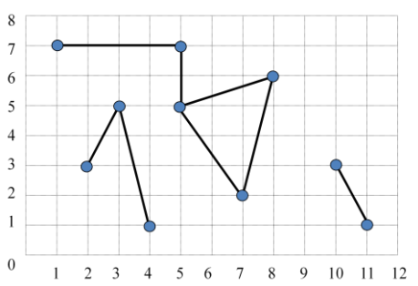

## 문제

There were n cities in an ancient kingdom. In the beginning of the kingdom, all cities were isolated. Kings ordered their subjects to construct roads connecting cities. A lot of roads were built with time. Every road was always constructed along the line segment between two cities. All cities are partitioned into disjoint components of cities by road-connectivity. A connected component of cities was called a state. A state consists of cities and roads connecting them.

A historical record tells a time sequence of road constructions in order. A road connecting two cities A and B doesn’t intersect with other roads at a point except for A and B. Before construction, A and B may have belonged to the same state or different states. After construction, A and B would belong to a same state, i.e., two states would merge into a state if needed.

Prof. Kim, a historian, is concerned about the following question: How many states does a horizontal line (corresponding to the latitude of a specific place) pass by at a moment of the past? The figure below shows an example of a configuration of roads at some moment. A circle represents a city and a line segment represents a road between two cities. There are 3 states. A line with y = 4.5 passes by two states with total 8 cities and a line with y = 6.5 passes by one state with 5 cities.

You are to write a program which handles the following two types of commands:

* road A B : A road between two cities A and B will be constructed. The road doesn’t intersect with other roads at a point except for A and B. This is an informative command and your program does not need to respond.
* line C : This is a query. The program should output the number of states which a line y = C passes by and the total number of cities of them.

## 입력

Your program is to read from standard input. The input consists of T test cases. The number of test cases T is given in the first line of the input. The first line of each test case contains an integer n, the number of cities, where 1 ≤ n ≤ 100,000. Each of the following n lines contains two integers x and y (0 ≤ x, y ≤ 1,000,000), where (x, y) represents the coordinate of a city. There is a single space between the integers. The cities are numbered from 0 to n-1 in order. The next line contains an integer m, the number of commands, where 1 ≤ m ≤ 200,000. Each of the following m lines contains a command, either “road A B” or “line C”, where 0 ≤ A ≠B < n and C (0 < C < 1,000,000) is a real number of which the fractional part is always 0.5. There exists at most one road construction connecting a pair of cities and there exists at least one query per a test case.

## 출력

Your program is to write to standard output. Print exactly one line for a query through all test cases. The line should contain two integers which represent the number of states and the total number of cities of them respectively.

The following shows sample input and output for three test cases.
