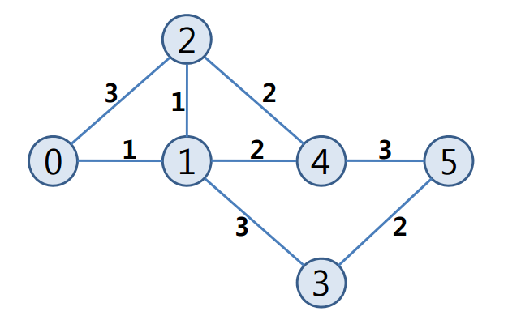

## 문제

Mr. Kim visits his hometown annually. He always drives his car following the shortest path to his hometown. Since he is a very economical person, he only fills his fuel tank with the amount of gasoline needed to follow the shortest path for fuel efficiency. Last year, he fueled the exact amount to travel the shortest path, but he was in big trouble because an unexpected accident occurred on the shortest path. That is, he was short of gasoline because he had to find a detour to get to his hometown.

This year, he wants to fuel enough gasoline considering unexpected detours caused by an accident. According to statistical reports, at most one accident occurs in a day. (His hometown can be reached if he drives all day long.) Thus he wants to fill his fuel tank with the smallest amount of gasoline supposing that there will be only one accident. For this, he will find the shortest path to get to his hometown wherever the accident occurs.

The road system can be represented as a weighted graph G = (V, E), where V is the set of vertices that represent cities, E is the set of edges that represent roads connecting two cities, and w(e) is the weight of each edge e that represents the amount of gasoline needed to drive the corresponding road. An accident always occurs in the middle of a road and the occurrence of the accident can be found when he reaches the cities which are incident with the road. This means that no accident can be reported in advance.

For example, consider the case when the city of departure is node 0 and the city of arrival is node 5 in the given graph below. Then the shortest path is P = <0,1,4,5> and the units of gasoline, i.e., the sum of weights on the shortest path, is W(P) = 6. Suppose that an accident occurs in the edge (0, 1) between the two cities 0 and 1. Then, the shortest detour at node 0 which does not make use of edge (0, 1) becomes <0,2,4,5> and it requires 2 more units of gasoline than path P. When an accident occurs at edge (1, 4) ( resp. edge (4, 5)) the shortest detour will be <1,3,5> ( resp. <4,1,3,5> ) and it requires 0 (resp. 4 ) more units of gasoline than the path P. So, Mr. Kim should fill his fuel tank with at least 10 units of gasoline since he needs 4 more units of gasoline than that of W(P), i.e., 4 more units of gasoline is the largest amount considering the detour by an unexpected accident for every node on the shortest path P.

When we are given the road system represented as a weighted graph and the shortest path from the city of departure to the city of arrival followed by Mr. Kim, find the smallest amount of gasoline that Mr. Kim has to fuel considering a detour by an accident.

## 입력

Your program is to read from standard input. The input consists of T test cases and the number of test cases T (1 ≤ T ≤ 20) is given in the first line of the input. Each test case starts with a line containing two integers n d m ich represent the number of cities and the number of roads with ranges of 3 ≤ n,m ≤ 10,000, respectively. The cities are numbered from 0 to n-1. In the next m lines are given with three integers c , d and w (separated by a space), where w represents the amount of gasoline needed to travel between the cities c and d (c ≠ d ). In the next line, k+1 integers are given representing the shortest path that Mr. Kim has chosen. The first integer is k as the total number of cities on the shortest path and the next k integers represent the cities along the path. That is, the second integer represents the city of departure and the last integer represents the city of arrival.

## 출력

Your program is to write to standard output. Print the amount of gasoline with which Mr. Kim should feed his fuel tank. If there exists no way to go to his hometown if an accident occurs, print -1.

The following shows sample input and output for two test cases.
