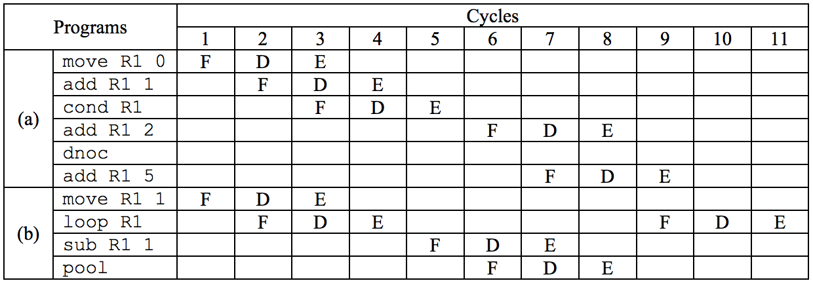

## 문제

A small computer of Von Neumann architecture named ICPC is used for the BDN Programming Contest. ICPC is a 16-bit integer machine. There is a sufficient number of instruction memory cells in ICPC but it has only one data memory cell. ICPC has 6 registers: R1, R2, R3, R4, R5, and PC. The Rn registers are general purpose but PC is the program counter storing the address of the next instruction to be executed. The PC value can be changed only by a group of control-flow instructions. This machine follows the usual fetch-decodeexecute cycles. The PC value is normally increased automatically except for the cases of the control flow instructions. ICPC has only two addressing modes, immediate value and register, but PC cannot be used as an operand. The whole set of instructions of ICPC is shown in Table 1. In Table 1, r denotes a register, v denotes a register or an integer value, and M denotes the data memory cell.

Table 1: The instruction set of ICPC

|  |  |
| --- | --- |
| ICPC Instruction | The meaning of the instruction in C |
| `load` r | r = M; |
| `store` v | M = v; |
| `move` r v | r = v; |
| `add` r v | r += v; |
| `sub` r v | r -= v |
| `loop` r    instructions  `pool` | `while` (r > 0) `{`    execute the instructions   } |
| `cond` r    instructions  `dnoc` | `if` (r > 0) {    execute the instructions   } |

Every step of the fetch-decode-execute cycle is called “cycle.” Therefore every instruction consumes three cycles at least and every ICPC instruction, except for dnoc, consumes exactly three cycles. The instruction dnoc is just used for denoting the end of cond and not executed at all. This kind of instruction is called a pseudo instruction; dnoc is the only pseudo instruction in ICPC. The instruction pool denotes the end of loop, just like dnoc, but it is executed indeed for the control flow should return the beginning of the loop at the end of a loop.

To minimize the execution time of programs, pipelining is usually adopted in modern computer architectures and ICPC also adopts it. Assuming that three instructions, namely A, B, and C, are to be executed in sequence, the decode cycle of A can overlap the fetch cycle of B and the execute cycle of A can overlap the decode cycle of B and also can overlap the fetch cycle of C. Therefore, it takes only 4 cycles for one move and one add instruction in sequence rather than 6 cycles, as shown in the first two instructions of Fig. 1(a). In Fig. 1, we used F for fetch, D for decode, and E for execute cycle.

Pipelining is stalled if the PC encounters a control flow instruction because we do not know the next instruction to be executed. The next instruction can be determined only after the control flow instruction is executed. The cond instruction in Fig. 1(a) shows this fact. Note that dnoc is not executed at all since it is a pseudo instruction and it takes 9 cycles to execute all the instructions in Fig. 1(a).

However the instruction pool, similar to dnoc, is really a control flow instruction. For example, in Figure 1(b), not only the instruction loop but also the instruction pool stalls the pipelining.

Figure 1: Example programs and the corresponding cycle counts

## 입력

Your program is to read the input from standard input. The input consists of T test cases. The number of test cases T is given in the first line of the input. The first line of each test case contains the number of lines L of ICPC instructions (L > 0) and the remaining L lines contain the sequence of ICPC instructions of the test case. Every instruction line contains exactly one ICPC instruction. The input may be indented according to the nesting of control structures. The loop and cond should contain at least one instruction, i.e. there is no empty loop or empty branch. The maximum number of characters in an input line is 100. Immediate values are 16-bit two’s complement integers, i.e. an immediate value N is in -32768 ≤ N ≤ +32767. The op code and the operands are separated with at least one blank character. There is no infinite loop in the test cases.

## 출력

Your program is to write to standard output. Your program should count the number of cycles when executing the ICPC program given in standard input. The initial contents of the data memory cell and the registers are assumed to be 0. When overflow or underflow occurs in any of the registers or the data memory cell, your program should write “error” rather than a cycle count.

The following shows sample input and output for three test cases.
