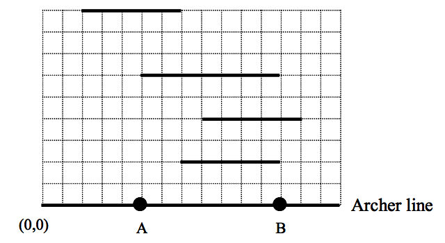

## 문제

Korea’s reputation in archery is well known because the Korean archery teams have been sweeping almost all gold, silver, and bronze medals in the Olympic Games.

An archery game ICPC supported by NEXON (one of Korea’s leading publishers of online contents) will be held in Korea. As a ceremonial event of the game, a famous master of archery will shoot an arrow to hit through all target boards made of paper. Because an arrow flies along a straight line, it depends on his position of the archer line whether or not he hits all targets.

The figure below shows an example of the complete view of a game field from the sky. Every target is represented by a line segment parallel to the archer line. Imagine the coordinate system of which the origin is the leftmost point of the archer line and the archer line is located on the positive x-axis.

In the above figure, the master can hit all targets in position B. However, he never hits all targets in position A because any ray from A intersects at most 3 targets.

Given the width of the archer line and the target locations, write a program for determining if there exists a position at which the master can hit all targets. You may assume that the y-coordinates of all targets are different. Note that if an arrow passes through an end point of a target, it is considered to hit that target.

## 입력

Your program is to read from standard input. The input consists of T test cases. The number of test cases T (1 ≤ T ≤ 30) is given in the first line of the input. Each test case starts with a line containing an integer W (2 ≤ W ≤ 10,000,000), the width of an archer line. The next line contains an integer N (2 ≤ N ≤ 5,000), the number of target boards. The i-th line of the following N lines contains three integers Di, Li, Ri (1 ≤ Di ≤ W, 0 ≤ Li < Ri ≤ W), where 1 ≤ i ≤ N, Di represents the y-coordinate of the i-th target, and Li and Ri represent the x-coordinates of the leftmost point and the rightmost point of the target, respectively. Note that Di ≠ Dj if i ≠ j.

## 출력

Your program is to write to standard output. Print exactly one line for each test case. Print “YES” if there exists a position on the archer line at which a master of archery can hit all targets, otherwise, “NO”.

The following shows sample input and output for three test cases.
