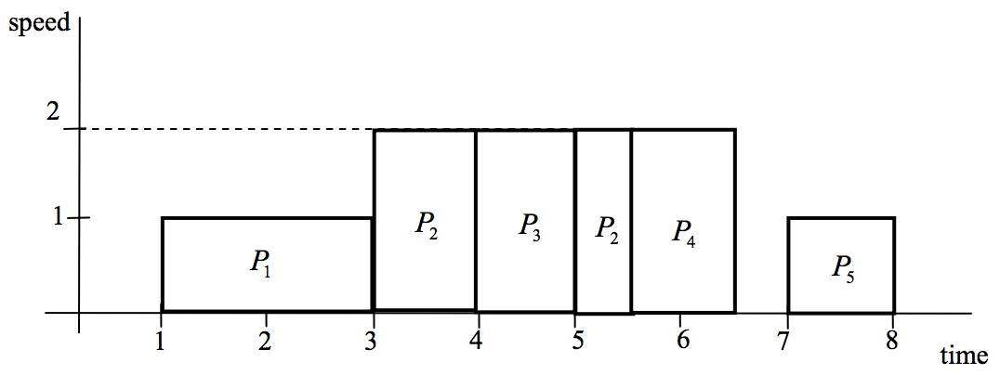

## 문제

An “early adopter” Mr. Kim bought one of the latest notebooks which has a speed-controlled processor. The processor is able to operate at variable speed. But the higher the speed, the higher the power consumption is. So, to execute a set of programs, adjusting the speed of the processor dynamically results in energy-efficient schedules. We are concerned in a schedule to minimize the maximum speed of the processor.

The processor shall execute a set of programs and each program Pi is given having a starting time ri, a deadline di , and work wi. When the processor executes the programs, for each program Pi, the work wi should be done on the processor within the interval [ri, di] to complete Pi . Also, the processor does not have to execute a program in a contiguous interval, that is, it can interrupt the currently running program and later resume it at the interrupted point. It is assumed that ri, di and wi are given positive integers. Recall that the processor can execute the programs at variable speed. If the processor runs the program Pi with work wi at a constant speed s, then it takes wi/s time to complete Pi . We also assume that the available speeds are positive integers, that is, the processor operates only at integer points of speed. The speed is unbounded and the processor may operate at sufficiently large speeds to complete all the programs. The processor should complete all the given programs and the goal is to find a schedule minimizing the maximum of the speeds at which the processor operates.

For example, there are five programs Pi with the interval [ri,di] and work wi, i=1,...,5, where [ri,di] =[1, 4], [r2,d2] =[3, 6], [r3,d3] = [4, 5], [r4,d4] = [4, 7], [r5,d5] = [5, 8] and w1=2, w2 = 3, w3 =2, w4 =2, w5 =1. Then the Figure 1 represents a schedule which minimizes the maximum speed at which the processor operates. The maximum speed is 2 in this example.

Figure 1

## 입력

Your program is to read from standard input. The input consists of T test cases T(1 ≤ T ≤ 20). The number of test cases is given on the first line of the input. The first line of each test case contains an integer n (1 ≤ n ≤ 10,000), the number of given programs which the processor shall execute. In the next n lines of each test case, the i -th line contain three integer numbers ri,di and wi, representing the starting time, the deadline, and the work of the program Pi, respectively, where 1 ≤ ri < di ≤ 20,000, 1 ≤ wi ≤ 1,000.

## 출력

Your program is to write to standard output. Print exactly one line for each test case. The line contains the maximum speed of a schedule minimizing the maximum speed at which the processor operates to complete all the given programs.

The following shows sample input and ouput for three test cases.
