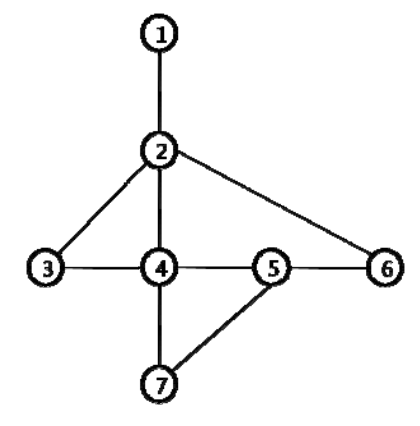

## 문제

Traveling salesmen of nhn. (the prestigious Korean internet company) report their current location to the company on a regular basis. They also have to report their new location to the company if they are moving to another location. The company keep each salesman’s working path on a map of his working area and uses this path information for the planning of the next work of the salesman. The map of a salesman’s working area is represented as a connected and undirected graph, where vertices represent the possible locations of the salesman an edges correspond to the possible movements between locations. Therefore the salesman’s working path can be denoted by a sequence of vertices in the graph.Since each salesman reports his position regularly an he can stay at some place for a very long time, the same vertices of the graph can appear consecutively in his working path. Let a salesman’s working path be correct if two consecutive vertices correspond either the same vertex or two adjacent vertices in the graph.

For example on the following graph representing the working area of a salesman,

a reported working path [1 2 2 6 5 5 5 7 4] is a correct path. But a reported working path [1 2 2 7 5 5 5 7 4] is not a correct path since there is no edge in the graph between vertices 2 a 7. If we assume that the salesman reports his location every time when he has to report his location (but possibly incorrectly), then the correct path could be [1 2 2 **4** 5 5 5 7 4], [1 2 **4** 7 5 5 5 7 4], or [1 2 2 **6** 5 5 5 7 4].

The length of a working path is the number of vertices in the path. We define the distance between two paths A = a1a2 . . . an and B = b1b2 . . . bn of the same length n as

\[ dist(A,B) = \sum\_{i=1}^{n} d(a\_i, b\_i) \]

where

\[ d(a,b) = \begin{cases} 0  & \text{if }a = b \\ 1   & \text{otherwise } \end{cases} \]

Given a graph representing the working area of a salesman and a working path (possible not a correct path), A, of a salesman, write a program to compute a correct working path, B, of the same length where the distance dist(A, B) is minimized.

## 입력

The input consists of T test cases. The number of test cases (T) is given in the first line of the input. The first line of each test case contains two integers n1, n2 (3 ≤ n1 ≤ 100, 2 ≤ n2 ≤ 4, 950) where n1 is the number of vertices of the graph representing the working map of a salesman and n2 is the number of edges in the graph. The input graph is a connected graph. Each vertex of the graph is numbered from 1 to n1. In the following n2 lines, each line contains a pair of vertices which represent an edge of the graph. The last line of each test case contains information on a working path of the salesman. The first integer n (2 ≤ n ≤ 200) in the line is the length of the path and the following n integers represent the sequence of vertices in the working path.

## 출력

Print one line for each test case. The line should contain the minimum distance of the input path to a correct path of the same length.
