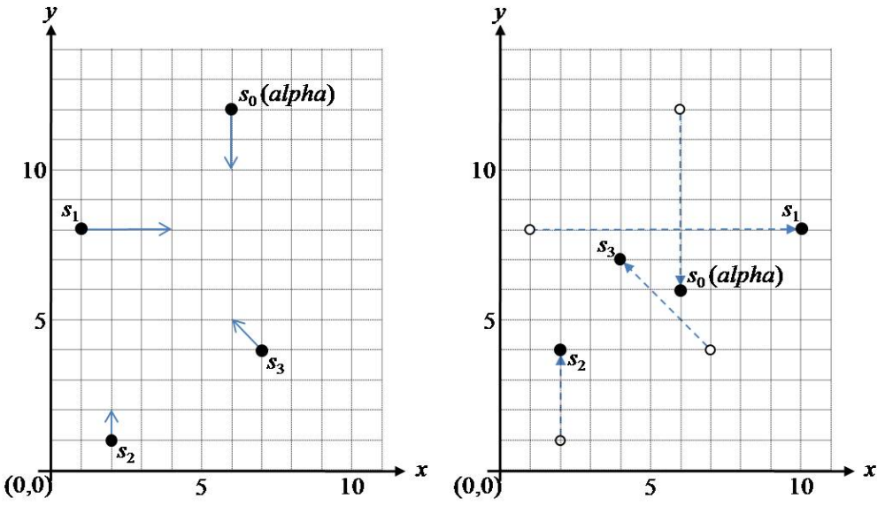

## 문제

An astrophysicist makes observations of a spiral galaxy known as the Andromeda Galaxy using the Hubble space telescope. In particular, he is interested in the motion of n stars in the galaxy. Each star moves with a constant velocity along a straight line in the picture of the Hubble space telescope. Among the n stars there is a special star named alpha. He wants to know when the maximum distance from alpha to the remaining n-1 stars is minimized.

The picture screen of the Hubble space telescope can be represented by a 2-D Cartesian coordinate system and let S = {s0,s1, ..., sn-1} be a set of n stars in the plane. Assume that the s0 is the star alpha. A star si of S moves along the trajectory pi + tvi over time t,where pi=(xi,yi) is the initial position of si in the 2-D coordinate system and vi=(ai,bi) is the velocity vector of si. We assume that there is no actual collision of two stars, i.e. the two stars pass through each other when they meet a point in 2-D space. Given a set of stars and their velocity, compute the time when the maximum distance from alpha to the remaining stars is minimized within 105 time units. If there is more than one such time, then output the earliest time.

Following figure 1 shows an example with 4 stars. The arrow of a star indicates its velocity vector. In this example, when the time is t=3, the maximum distance from alpha to the remaining 3 stars is minimized.

(a) at time t=0                                                      (b) at time t=3

Figure 1. An Example.

## 입력

Your program is to read the input from standard input. The input consists of T test cases. The number of test cases T is given in the first line of the input. Each test case starts with a line containing an integer n (2 ≤ n ≤ 50,000), the number of stars of S. Each of the next n lines contains four integers xi, yi and ai, bi; (xi, yi) is the position of a star si at time zero and (ai, bi) is the velocity vector of the star si (-200,000 ≤ xi, yi≤ 200,000, -500 ≤ ai, bi≤ 500). Two or more stars of S may have the same coordinates at time zero.

## 출력

Your program is to write to standard output. Print the time when the maximum distance is minimized from s0 (alpha) to the remaining n-1 stars {so, s1, ... , sn-1} within 105 time units, rounded to 4 fractional digits.

The following shows sample input and output for five test cases.
