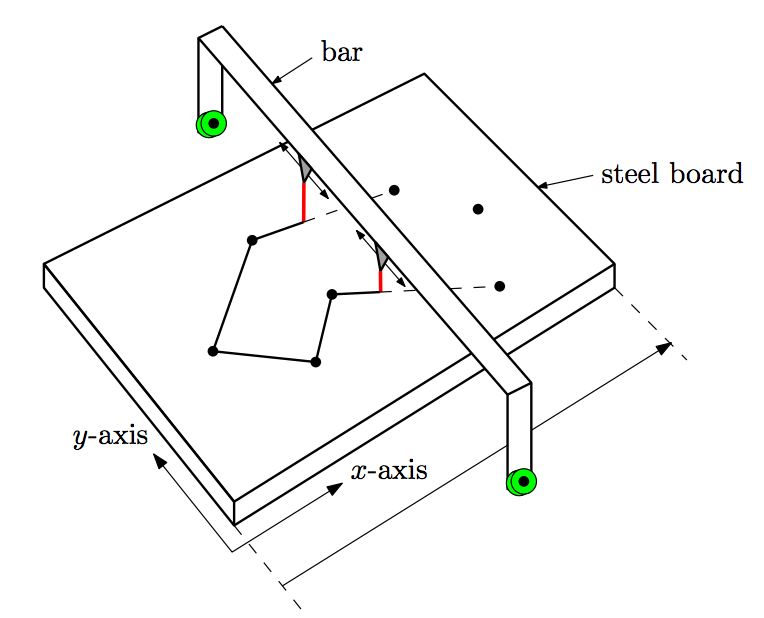
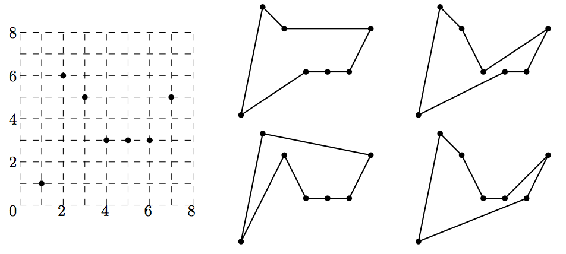

## 문제

You, a promising metal-artist, try to make a metalwork, a piece of steel. You first mark n points on a big steel board, and cut a polygon connecting those n points from the board. For this cutting, you melt the board along the boundary of the polygon with two lasers hanging down from a long bar over the board as shown in Figure 1. The bar is vertical, i.e., parallel to the y-axis, and moves continuously (without stopping) only in the positive x-direction, i.e., from the left side to the right side of the board. The lasers can move only along the bar and can never meet on the bar. Furthermore, the bar moves monotonously from left to right, it can never move to a position left of its current position. These conditions imply that the polygons you can obtain must be simple and monotone. A polygon P is simple if any two edges of P do not intersect except for the endpoints of adjacent edges, and there are no holes inside P . A polygon P is monotone if any intersection of P with a vertical line is either a point or a line segment. To choose a proper shape for your metalwork, you want to know how many different simple and monotone polygons of the n points exist.

Figure 1.

A cutting tool with two lasers hanging from a vertical bar. For example, see Figure 2, where seven points are given as an input. There are four different simple and monotone polygons for this input. Your task is to compute the number of different simple and monotone polygons of n given points.

Figure 2. There are four different simple and monotone polygons for seven input points.

## 입력

Your program is to read the input from standard input. The input consists of T test cases. The number of test cases T is given in the first line of the input. Each test case starts with a line containing an integer n (3 ≤ n ≤ 50), the number of points of S = {s0, s1, ..., sn-1} . Each of the next n lines contains two nonnegative integers xi and yi (0 ≤ xi, yi ≤ 200,000), where point si has coordinates (xi, yi). No two points of S have the same x-coordinate.

## 출력

Your program is to write to standard output. For each test case, print the number of different simple and monotone polygons which connect n points of S.

The following shows sample input and output for two test cases.
