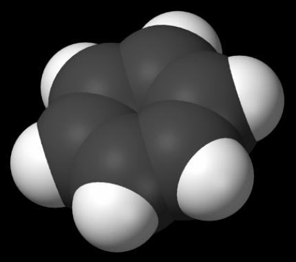

## 문제

An organic compound is any member of a large class of chemical compounds whose molecules contain carbon. The molar mass of an organic compound is the mass of one mole of the organic compound. The molar mass of an organic compound can be computed from the standard atomic weights of the elements.

When an organic compound is given as a molecular formula, Dr. CHON wants to find its molar mass. A molecular formula, such as C3H4O3, identifies each constituent element by its chemical symbol and indicates the number of atoms of each element found in each discrete molecule of that compound. If a molecule contains more than one atom of a particular element, this quantity is indicated using a subscript after the chemical symbol.

In this problem, we assume that the molecular formula is represented by only four elements, ‘C’ (Carbon), ‘H’ (Hydrogen), ‘O’ (Oxygen), and ‘N’ (Nitrogen) without parentheses.

The following table shows that the standard atomic weights for ‘C’, ‘H’, ‘O’, and ‘N’.

| Atomic Name | Carbon | Hydrogen | Oxygen | Nitrogen |  |
| --- | --- | --- | --- | --- | --- |
| Standard Atomic Weight | 12.01 g/mol | 1.008 g/mol | 16.00 g/mol | 14.01 g/mol |

For example, the molar mass of a molecular formula C6H5OH is 94.108 g/mol which is computed by 6×(12.01 g/mol) + 6×(1.008 g/mol) + 1×(16.00 g/mol). Given a molecular formula, write a program to compute the molar mass of the formula.

## 입력

Your program is to read from standard input. The input consists of T test cases. The number of test cases T is given in the first line of the input. Each test case is given in a single line, which contains a molecular formula as a string. The chemical symbol is given by a capital letter and the length of the string is greater than 0 and less than 80. The quantity number n which is represented after the chemical symbol would be omitted when the number is 1 ( 2 ≤ n ≤ 99 ).

## 출력

Your program is to write to standard output. Print exactly one line for each test case. The line should contain the molar mass of the given molecular formula.
