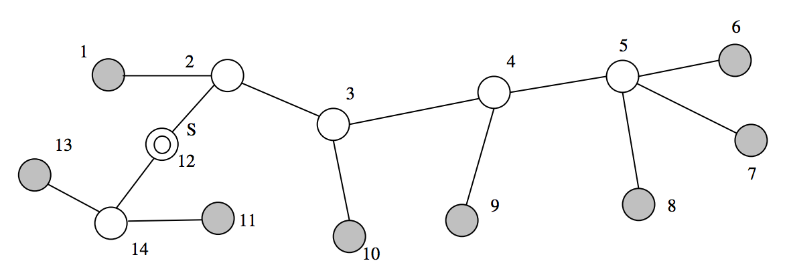

## 문제

Consider a tree network with n nodes where the internal nodes correspond to servers and the terminal nodes correspond to clients. The nodes are numbered from 1 to n . Among the servers, there is an original server S which provides VOD (Video On Demand) service. To ensure the quality of service for the clients, the distance from each client to the VOD server S should not exceed a certain value k . The distance from a node u to a node v in the tree is defined to be the number of edges on the path from u to v . If there is a nonempty subset C of clients such that the distance from each u in C to S is greater than k , then replicas of the VOD system have to be placed in some servers so that the distance from each client to the nearest VOD server (the original VOD system or its replica) is k or less.

Given a tree network, a server S which has VOD system, and a positive integer k , find the minimum number of replicas necessary so that each client is within distance k from the nearest server which has the original VOD system or its replica.

For example, consider the following tree network.

In the above tree, the set of clients is {1, 6, 7, 8, 9, 10, 11, 13}, the set of servers is {2, 3, 4, 5, 12, 14}, and the original VOD server is located at node 12.

For k = 2 , the quality of service is not guaranteed with one VOD server at node 12 because the clients in {6, 7, 8, 9, 10} are away from VOD server at distance > k . Therefore, we need one or more replicas. When one replica is placed at node 4, the distance from each client to the nearest server of {12, 4} is less than or equal to 2. The minimum number of the needed replicas is one for this example.

## 입력

Your program is to read the input from standard input. The input consists of T test cases. The number of test cases ( T ) is given in the first line of the input. The first line of each test case contains an integer n (3 ≤ n ≤ 1,000) which is the number of nodes of the tree network. The next line contains two integers s (1 ≤ s ≤ n) and k(k ≥ 1) where s is the VOD server and k is the distance value for ensuring the quality of service. In the following n −1 lines, each line contains a pair of nodes which represent an edge of the tree network.

## 출력

Your program is to write to standard output. Print exactly one line for each test case. The line should contain an integer that is the minimum number of the needed replicas.

The following shows sample input and output for two test cases.
