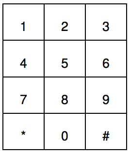
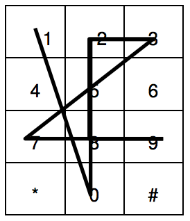
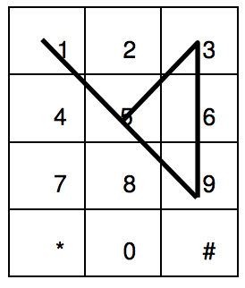
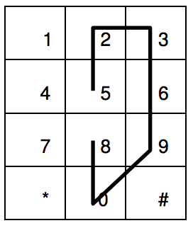

## 문제

Mobile phones prevail in everyday life. Every mobile phone has a number pad for users to dial the telephone number. Figure 1 shows a typical layout of number pads, which can be represented as 4 by 3 rectangular cells. We know that some mobile phone numbers are easy to memorize, since entering in sequence of digits implies an easy-to-remember geometric figure.

Figure 1

For each phone number, we can make a corresponding geometric figure, Phone Plot, which is a sequence of connected line segments. Assume that a phone number with n digits is d1 d2 d3 . . . . . dn-1 dn . The first line segment of Phone Plot is a line segment connecting the center points of pad d1 and pad d2 . The second line segment of Phone Plot connects the center points of pad d2 and d3 . In a similar way the k-th line segment connects the center points of pad dk and pad dk+1 , and the last segment connects dn-1 and dn .

Let us show a few examples. The Phone Plot for the number 1023289873 is shown as the thick lines in Figure 2(a). Figure 2(b) shows that the Phone Plot for a number 1159533969.

Figure 2(a)

Figure 2(b)

You should note that some connecting line segments may overlap other line segment collinearly.

We characterize a Phone Plot by the Minimal Number of Decomposing Segments(MNDS). MNDS is the minimal number of line segments to reconstruct the given Phone Plot. So we easily find that the MNDS of the number 1023289873 is 5, and the MNDS of 1159533969 is 3. If the Phone Plot is reduced to a single point for a number (e.g., 0000000000), then MNDS of such a point Phone Plot is defined 0.

We want to classify the phone number into three disjoint classes; EXCELLENT, GOOD and BAD by the complexity of Phone Plot. Thus if the MNDS of Phone Plot is at most 3, then this number is classified to EXCELLENT. If MNDS is exactly 4, then this number is classified to GOOD. If the MNDS is greater than or equal to 5, that number is classified to BAD.

According to this classification, we say 1023289873 is BAD and 1159533969 is EXCELLENT. Figure 3 shows another example with 5233999008. Since the MNDS of 5233999008 is 5, so this number is BAD.

Figure 3

You have to decide whether the phone number given is EXCELLENT or GOOD or BAD according to the MNDS of the Phone Plot.

## 입력

Your program is to read from standard input. The input consists of T test cases. The number of test cases T is given in the first line of the input. Each test case starts with a string representing a phone number. The length of a phone number string is greater than 5 and less than 20.

## 출력

Your program is to write to standard output. For each test case, print EXCELLENT or GOOD or BAD in a line. The following shows four test cases.
