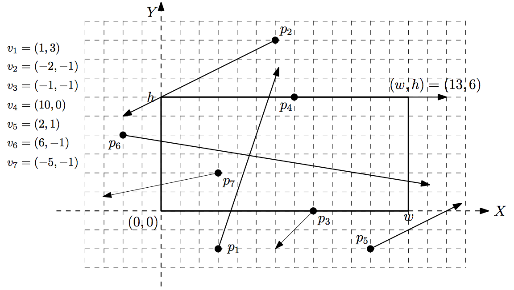

## 문제

The famous Korean internet company nhn has provided an internet-based photo service which allows users to directly take a photo of an astronomical phenomenon in space by controlling a high-performance telescope owned by nhn. A few days later, a meteoric shower, known as the biggest one in this century, is expected. nhn has announced a photo competition which awards the user who takes a photo containing as many meteors as possible by using the nhn photo service. For this competition, nhn provides the information on the trajectories of the meteors at their web page in advance. The best way to win is to compute the moment (the time) at which the telescope can catch the maximum number of meteors.

You have n meteors, each moving in uniform linear motion; the meteor mi moves along the trajectory pi + t × vi over time t , where t is a non-negative real value, pi is the starting point of mi and vi is the velocity of mi. The point pi = (xi,yi) is represented by X-coordinate xi and Y-coordinate yi in the (X ,Y) -plane, and the velocity vi = (ai,bi) is a non-zero vector with two components ai and bi in the (X ,Y) -plane. For example, if pi = (1,3) and vi = (-2,5), then the meteor mi will be at the position (0,5.5) at time t = 5.0 because pi + t × vi = (1,3) + 0.5 × (-2,5) = (0,5.5). The telescope has a rectangular frame with the lower-left corner (0, 0) and the upper-right corner (w,h) . Refer to Figure 1. A meteor is said to be in the telescope frame if the meteor is in the interior of the frame (not on the boundary of the frame). For example, in Figure 1, p2 , p3, p4 , and p5 cannot be taken by the telescope at any time because they do not pass the interior of the frame at all. You need to compute a time at which the number of meteors in the frame of the telescope is maximized, and then output the maximum number of meteors.

Figure 1

## 입력

Your program is to read the input from standard input. The input consists of T test cases. The number of test cases T is given in the first line of the input. Each test case starts with a line containing two integers w and h (1 ≤ w, h ≤ 100,000 ), the width and height of the telescope frame, which are separated by single space. The second line contains an integer n , the number of input points (meteors), 1 ≤ n ≤ 100,000 . Each of the next n lines contain four integers xi, yi, ai and bi ; (xi,yi) is the starting point pi and (ai,bi) is the nonzero velocity vector vi of the i-th meteor; xi and yi are integer values between -200,000 and 200,000, and ai and bi are integer values between -10 and 10. Note that at least one of ai and bi is not zero. These four values are separated by single spaces. We assume that all starting points pi are distinct.

## 출력

Your program is to write to standard output. Print the maximum number of meteors which can be in the telescope frame at some moment.

The following shows sample input and output for two test cases.
