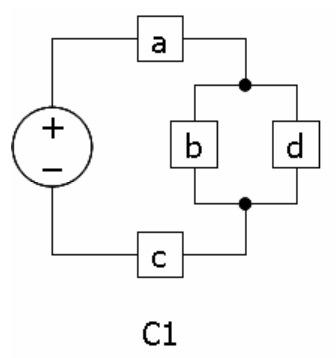
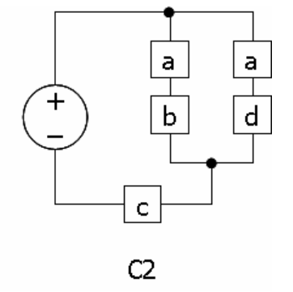
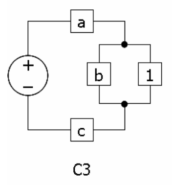
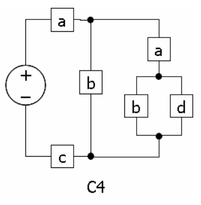
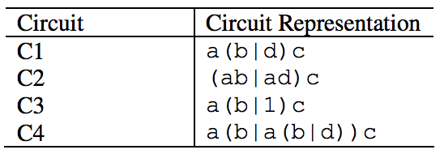
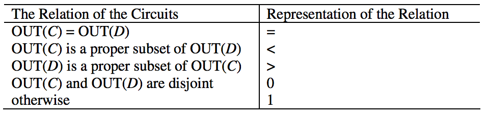

## 문제

Let DC (direct current) circuits be given. Each DC circuit generates a set of output signals. The DC circuits consist of a set of devices connected in parallel or in serial but they have no feedback loops. Each device generates a specific signal and the set of output signals of a circuit is determined by the kinds of devices and the topology of the device connection. For example, let two circuits named C1 and C2 be given as follows:

For C1, two signals, namely abc and adc can be generated. Given a circuit C, the output OUT(C) of it is defined as the set of signals which can be generated by C. For C1, the output of C1 is {abc, adc}, i.e. OUT(C1) = {abc, adc}. By the way, OUT(C2) is also {abc, adc}. For the above circuits, OUT(C1) = OUT(C2).

There is a special device called the pass device, namely 1, generating no signal at all. The circuit C3 contains a pass device. The parallel connections and serial connections of sub-circuits can be arbitrarily nested and composed as shown in circuit C4.

For C3, the output is {abc, ac}, i.e. OUT(C3) = {abc, ac}; for C4, the output is {abc, aabc, aadc}, i.e. OUT(C4) = {abc, aabc, aadc}.

The problem is to determine the relation of two given circuits. The names of normal devices are given by lowercase letters depending on the signals generated by them. The name of the pass device is 1. The parallel connection of two circuits C and D is denoted by C|D and the serial connection of two circuits C and D in a row is denoted by CD. The parentheses can be used as needed to clarify the topology of connections, but no spaces are allowed in a circuit description.

For example, the denotations of the above circuits are given as follows:

There can be redundant parentheses around the representation of sub-circuits. For instance, C1 can be represented by (a((b)|((d)))c) instead of a(b|d)c.

The comparison result of two circuits is denoted by =, <, >, 0, and 1. Given two circuits C and D, the relation between them is determined as follows:

Assume that every circuit generates at least one signal. In other words, there’s no circuit whose output is {} though it is allowed for nested circuits such as 1 or (1|1).

## 입력

Your program is to read the input from standard input. The input consists of T test cases. The number of test cases T is given in the first line of the input. Each test case is given by two circuit representations separated by one or more spaces. The length of a circuit representation is less than 50; and the number of test cases is less than 30.

## 출력

Your program is to write to standard output. For an input test case representing two circuits C and D in sequence, print a character representing the relation of C and D in one line. Hence, the number of output lines is equal to the number of test cases.

The following shows sample input and output for five test cases.
