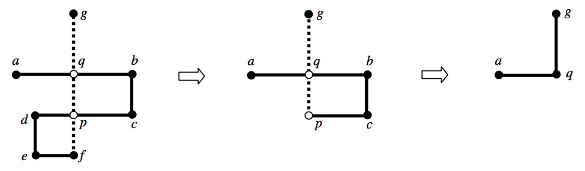
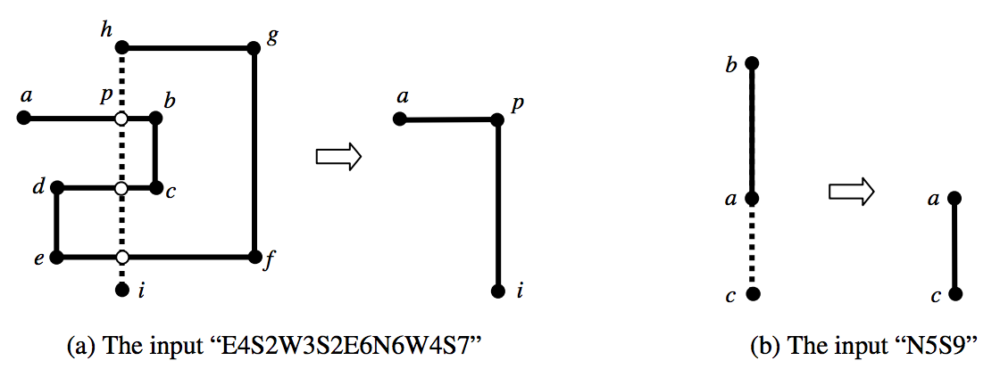

## 문제

You are going to draw a figure on a monitor using a keyboard of a computer. The figure which you want to draw is a polygonal chain which consists of horizontal or vertical line segments only. In order to draw the figure, you should press some keys successively. A sequence of keys consists of pairs of a direction key and a digit key. The direction keys consist of four keys which are labeled as ‘N’, ‘S’, ‘E’, and ‘W’. The symbols ‘N’, ‘S’, ‘E’, and ‘W’ represent North, South, East, and West respectively. The digit keys consist of 10 keys which are labeled as ‘0’, ‘1’, ... , ‘9’.

Initially, the cursor is located at the center of a monitor screen. If you will enter “S4E3”, i.e. you’ll press the keys ‘S’, ‘4’, ‘E’, and ‘3’ in order, an L-shaped chain will appear on the monitor. When you first press the two keys ‘S’ and ‘4’, a vertical line segment with length 4 from the current cursor position, i.e. the center of the screen, to the south is drawn and the cursor is located at the endpoint of that segment. When you press next the two keys ‘E’ and ‘3’, a horizontal line segment with length 3 from the current cursor position to the east is drawn.

Your computer program always keeps the polygonal chain simple. In other words, the polygonal chain on the monitor doesn’t have either a cycle or an overlapped segment. Whenever the program finds a cycle or an overlap in the drawing, it instantly gets rid of it. For example, if you enter “E6S2W5S2E2N7”, two intersection points p and q occur in order by the last segment (see Figure 1). The program first gets rid of the cycle (p, d, e, f) containing the intersection p, then the cycle (q, b, c, p) containing q as shown in Figure 1. Hence, the resulting chain on the monitor is the same as the chain by “E3N3”. If you enter “E4S2W3S2E6N6W4S7”, the program gets rid of the cycle (p, b, c, d, e, f, g, h) created by the first intersection point p as shown in Figure 2 (a). After removing this cycle, the other intersections disappear. The resulting chain is the same as that by “E3S5”. If you enter “N5S9”(resp. “N9S5”), the resulting chain is identical to that by “S4”(resp. “N4”) as shown in Figure 2 (b).

Figure 1: The input “E6S2W5S2E2N7” (a is the center of a monitor screen)

Figure 2: Drawing Examples (a is the center of a monitor screen)

Given a sequence of keys, write a program for computing the resulting chain. You can assume that the size of the monitor screen is sufficiently large.

## 입력

Your program is to read from standard input. The input consists of T test cases. The number of test cases T is given in the first line of the input. Each test case is given in a single line, which contains a string d1 f2 d2 f2 ... dn fn, where di ∈ {‘N’, ‘S’, ‘E’, ‘W’}, fi ∈ {‘0’, ‘1’, ... , ‘9’}, and 1 ≤ n ≤ 5,000.

## 출력

Your program is to write to standard output. Print exactly one line for each test case. Print two integers m and L, where m is the number of line segments on the resulting chain and L is the length of that chain, i.e. the total sum of the lengths of all line segments on the chain.
