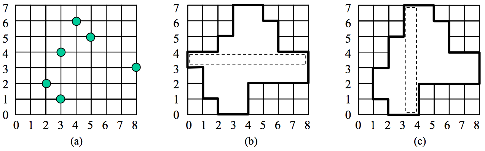

## 문제

There is a factory where grid panels are produced. Sometimes a newly made panel has some faults, which are holes at grid points of the panel. The workers in the factory gather all panels with faults, and then cut off the portions containing holes, finally replacing them with faultless pieces of panels. They have to cut along grid lines and remove a connected region containing all grid cells adjacent to each hole from a faulty panel. The connected region must satisfy the following conditions:

(i) It contains all grid cells adjacent to each hole.  
(ii) It contains all grid cells on a row or a column of the panel which is selected as a base cutting strip.  
(iii) It is a rectilinear convex polygon.  
(iv) It is a region with the minimum area among all rectilinear polygons satisfying (i), (ii), and (iii).

A polygon is said to be a rectilinear polygon if its boundary consists of horizontal or vertical line segments only. A rectilinear polygon is said to be a rectilinear convex polygon if its intersection with every horizontal or vertical line is either empty or a line segment.

For example, consider an 8 × 7 panel with 6 holes in Fig. 1(a). If the fourth row from the bottom is selected as a base cutting strip, a connected region with 29 grid cells is removed (see Fig. 1(b)). If the fourth column from the left is selected, a connected region with 27 grid cells is removed (see Fig. 1(c)), which is the smallest rectilinear convex polygon.

Figure 1

Given the dimensions of a panel and the positions of holes, write a program for computing the smallest rectilinear convex polygon satisfying the above conditions. Since the area of a grid cell is 1, the area of the rectilinear convex polygon in Fig. 1(c) is 27.

## 입력

Your program is to read from standard input. The input consists of T test cases. The number of test cases T is given in the first line of the input. Each test case starts with a line containing two integers w and h, the width and the height of a panel, 2 ≤ w, h ≤ 50,000. In the second line, an integer n (1 ≤ n ≤ 1,000) is given, where n is the number of holes. Each of the following n lines contains two integers x and y (0 ≤ x ≤ w, 0 ≤ y ≤ h), where (x, y) represents the coordinate of a hole. Assume that the left-bottom corner of a panel is the origin of the coordinate system. There is a single space between the integers.

## 출력

Your program is to write to standard output. Print exactly one line for each test case. Print an integer, the area of the rectilinear convex polygon which minimally covers all holes on the panel.

The following shows sample input and output for three test cases.
