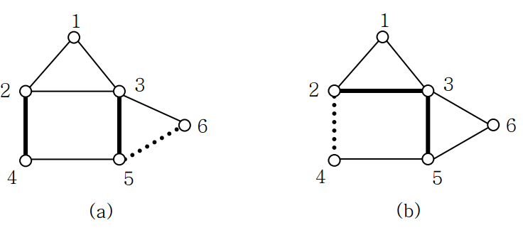

## 문제

Kim works in a traveling agency in Korea. Recently, his foreign customer gave him an international call and asked him to make a travel plan in Korea. The customer wants to visit two famous roads along which beautiful flowers are in full blossom. The customer would like to fly to a city in the plan and rent a car, enjoy his travel, and return to the city where he started. He does not want to visit the same city or the same road twice. Also, he hates to travel along any toll roads. It does not matter how many cities are included in the plan. Can Kim make a travel plan satisfying the requirements?

For example, see the maps in Figure 1. In the figure a circle represents a city and the line between two cities represents the road between them. The two bold lines represent the famous roads that the customer wants to visit and the dotted line is a toll road.

Figure 1

In case of Figure 1(a), Kim can make travel plans such as 1→2→4→5→3→1 and 2→3→5→4→2. In case of Figure 1(b), Kim can not make any plan satisfying the requirements.

You are to write a program to help Kim. For a given map with two famous roads and some toll roads, your program should determine whether there can be a travel plan satisfying the requirements.

## 입력

Your program is to read from standard input. The input consists of T test cases. The number of test cases T is given in the first line of the input. Each test case starts with a line containing two integers N and M , the number of cities and the number of roads in the map, respectively, where 5 ≤ N ≤ 1000. In the next M lines, each line contains two positive integers that represent a road connecting two cities. In the next two lines, each line contains a road that the customer wants to visit. In the next line, the number of toll roads F is given, 0 ≤ F  ≤ M. In the next F lines, each line contains toll roads. Assume the cities are labeled from 1 to N and there is at most one road between two cities. Also, assume the two roads that the customer wants to visit are not toll roads.

## 출력

Your program is to write to standard output. Print exactly one line for each test case. For each test case, print YES if there can be a travel plan satisfying the requirements. Otherwise, print NO.

The following shows sample input and output for three test cases.
