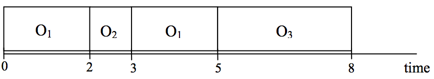

## 문제

A college student Ji-Sung has a roommate, Young-Pyo, who shares a room with him in the dormitory. Since they have lived together for a long time, they also share household facilities, for example, a hair dryer, an electric iron, a battery charger, etc. So the time periods when they want to use one facility should not overlap.

Some day, Ji-Sung and Young-Pyo both have a sequence of facilities oi1, oi2, ..., oin and oj1, oj2, ..., ojm, respectively, which they want to use in this order. Here a facility can be used more than once, that is, oik = oil, for some k, l. It takes pi and qi time units that Ji-Sung and Young-Pyo use the facility oi , respectively. The problem is to minimize the finishing time by which they have used all facilities.

For example, Ji-Sung and Young-Pyo share household facilities o1, o2, o3, which they use during 1, 2, 1 and 2, 1, 3 time units, respectively. At some day, they use the facilities o1, o3, o1, o2 and o1, o2, o1, o3 in order, respectively. Then the following figure represents the schedule which minimizes the finishing time. The minimum finishing time is 8 in this example.

Ji-Sung :      

Young-Pyo : 

## 입력

Your program is to read from standard input. The input consists of T test cases. The number of test cases T is given on the first line of the input. The first line of each test case contains an integer n, 1 ≤ n ≤ 50, the number of facilities. The second and third line of each test case contain a sequence of n integers between 1 and 100, where the i -th number, 1 ≤ i ≤ n, represents the number of time units during which Ji-Sung and Young-Pyo use the facility i , respectively. The fourth line of each test case contains two integer numbers α and 1 ≤ α,β ≤ 300 , the lengths of the sequences of facilities which Ji-Sung and Young-Pyo will use at the day, respectively. The fifth and sixth line of each test case contain a sequence of integers between 1 and n, representing a sequence of facilities which Ji-Sung and Young-Pyo will use in order at the day, respectively.

## 출력

Your program is to write to standard output. Print exactly one line for each test case. The line contains the minimum time by which both Ji-Sung and Young-Pyo finish to use all the facilities.

The following shows sample input and ouput for three test cases.
