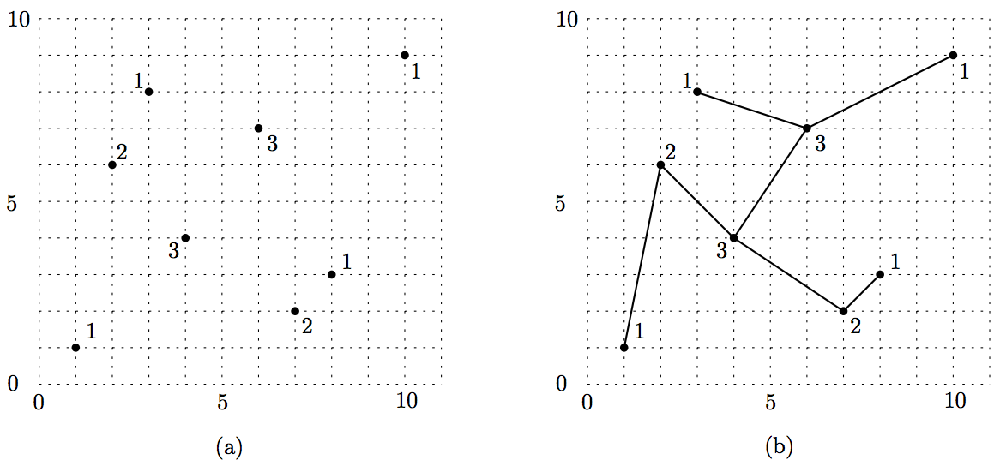

## 문제

You have n points P = {p1, p2, ..., pn} in the plane. The points should be connected to form a tree. But you know only the degree information of points of the tree (not the tree itself). Each point pi has degree di, which means that  pi is connected to di other points of P. Figure 1(a) shows an example in which each point is associated with its degree. Figure 1(b) shows a tree for the point set in Figure 1(a) such that a node of the tree corresponds to a point  pi in one-to-one manner and its degree is di. Tree edges must be drawn as straight-line segments and they do not cross each other.

Figure 1

The formal definition of the problem is as follows. You are given a point set P = {p1, p2, ..., pn} in the plane where each pi has a positive integral value di as its degree; the degrees satisfy

\( \sum\_{i=1}^{n} d\_i = 2n-2 \)

It is known that it is always possible to draw a tree such that each tree node of degree di corresponds to a point pi and each edge is drawn as a straight-line segment without edge crossings. Your program should find the tree for a given input.

## 입력

Your program is to read the input from standard input. The input consists of T test cases. The number of test cases T is given in the first line of the input. Each test case starts with a line containing an integer n , the number of input points, 4 ≤ n ≤ 1000. The next n lines contain x -coordinates, y-coordinates, degrees of n the points; the i-th line represents the i -th point pi and contains three positive integers xi, yi, and di The values xi, yi, di are separated by a single space, and xi, yiare between 1 and 10,000, both inclusive. The input points are such that no three or more points lie on the same line, all x -coordinates are distinct, and all y -coordinates are distinct.

## 출력

Your program is to write to standard output. Print edges of the tree in n −1 lines for each test case. Note that the solution for each test case is not unique. Each line contains an edge of the tree – if the edge connects two points pi and pj, then just print i and j , separated by a single space.

The following shows sample input and output for three test cases.
