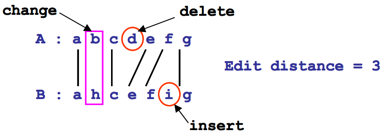

## 문제

Given two strings A and B over an alphabet ∑ , the edit distance between A and B is the minimum number of edit operations needed to convert A into B. The three edit operations are the following:

(i) change: replace one character of A by another single character of B.  
(ii) deletion: delete one character from A.  
(iii) insertion: insert one character of B into A.

For example, the following figure shows that the edit distance between the strings A=abcdefg and B=ahcefig is 3. The edit operations are a change (i.e., replacing b of A by h of B), a deletion (i.e., deleting d from A), and an insertion (i.e., inserting i of B into A).

We now define a period of a repetitive string as follows: The string p is called the exact period of a string x if x can be written as x = pk , where k ≥ 1 and p is the shortest string. For example, if x =abababab then x = (abababab)1 = (abab)2 = (ab)4 . Thus, the string ab is the exact period of x.

We define an approximate period similarly. Given two strings x and y, suppose that the string x is partitioned into substrings pi, 1 ≤ i ≤ t, where pi is not a null string, i.e., x = p1 ⋅ p2 ⋅ p3 ⋅⋅⋅⋅ pt. If the edit distance between a string y and each substring pi is less than or equal to an integer k, string y is called a k-approximate period of string x.

In this problem, given two strings x and y, we want to find the minimum k such that string y is a kapproximate period of string x. For example, suppose that two strings x = abcdabcabb and y=abc are given. Since x may be partitioned into x = p1 ⋅ p2 ⋅ p3 = abcd ⋅ abc ⋅ abb and the edit distances between string y=abc and each substring abcd, abc, and abb equal to 1, 0, and 1, respectively, y is a 1-approximate period of x. Hence, the minimum k is one.

## 입력

Your program is to read from standard input. The input consists of T test cases. The number of test cases T is given in the first line of the input. For each test case, a string y is given in the first line and the string x is given in the next line. The length of string y is at least 1 and at most 50, the length of string x is at least 1 and at most 5000, and the alphabet ∑ is the set of lowercase English characters.

## 출력

Your program is to write to standard output. Print exactly one line for each test case. Print the minimum integer value k such that string y is a k-approximate period of string x.

The following shows sample input and output for three test cases.
