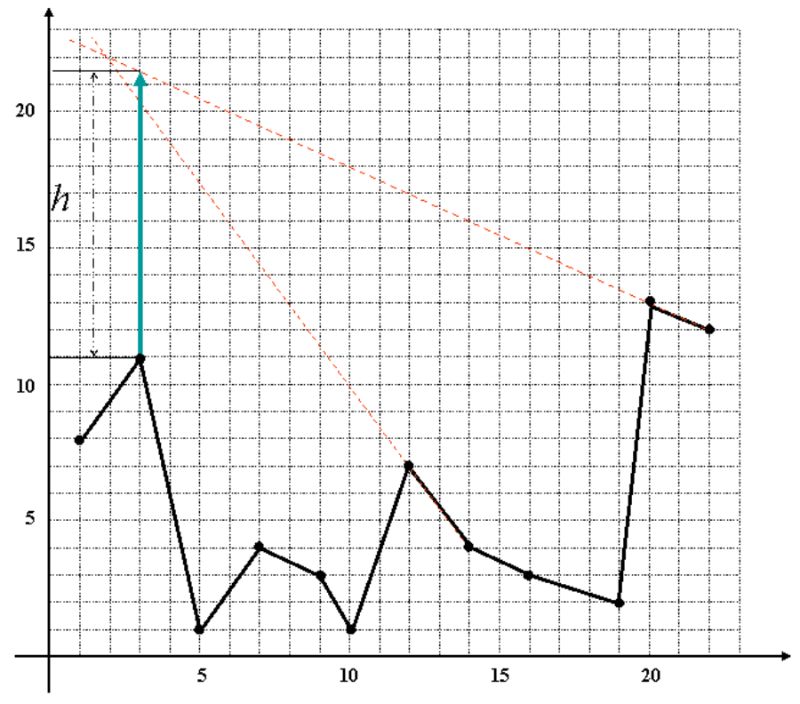

## 문제

A mountainous region had many forest fires in the dry season of the last year. Prior to the dry season of this year, to watch the forest fire, you are planning to construct a fire tower which enables us to watch all mountain slopes. To minimize the construction cost, you want to minimize the height of the fire tower.

A polyhedral terrain can be thought of as the surface of a mountain range with flat faces and with no curves or overhangs. In this problem, we consider only the 2-dimensional case, which simplifies the polyhedral terrain into a 2-dimensional polygonal chain in the plane. This polygonal chain is represented by n consecutive vertices v1, v2, ..., vn that are given by increasing order of x-coordinate of the vertices and n −1 edges which connect two adjacent vertices vi and vi+1 for 1 ≤ i ≤ n - 1 .

Following figure shows the minimum height fire tower of a polygonal chain.

Your task is to compute the minimum height of the fire tower on a polygonal chain such that every point on the polygonal chain is visible from the top of the fire tower. Note that the fire tower can be placed on a vertex or an edge of the polygonal chain. You can assume that there are no cases where the minimum height of the fire tower is zero.

## 입력

Your program is to read from standard input. The input consists of T test cases. The number of test cases T is given in the first line of the input. Each test case starts with a line containing an integer n, the number of input points, 4 ≤ n ≤ 1000. In the next n lines, the coordinates of a polygonal chain’ s vertices are given in increasing order of x-coordinate. Each line contains two positive integers x and y that represent the coordinates of the vertex, 0 ≤ x,y ≤ 100,000.

## 출력

Your program is to write to standard output. Print exactly one line for each test case. For each test case, print the minimum height of the fire tower that watches the given polygonal chain with rounded one fractional digit. If the height of the fire tower is greater than 000,1 then print IMPOSSIBLE.

The following shows a sample input with three test cases and its output.
