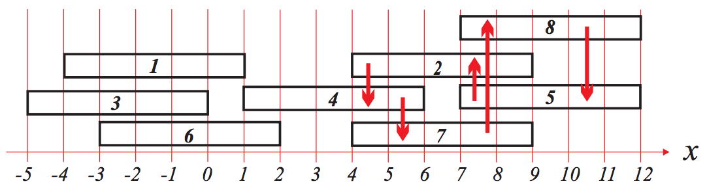

## 문제

There are sports facilities in the mountain at the back of our village for the villagers to build up their physical strength. One of the facilities consists of many logs placed along a straight trail through the forest. All the logs are of the same length and are placed in a parallel direction to the trail. ‘Log jumping’ is one of the famous games played in the facility. The game, which involves mental skills, is to visit as many logs as possible in the following way.

1. One first selects an arbitrary log and visits the log. Visiting means jumping on the log. Moving on the log is allowed.
2. Next, he/she selects an unvisited log and visits it. The direction of jumping should be perpendicular to the direction of logs. Repeat Step 2 if he/she wants.
3. The last log visited should be identical to the first one. Visiting a log except the first/last one is allowed at most one time. When one returns to the first log, the game ends.

For example, let us have eight logs of length five numbered from 1 to 8 as depicted in the figure below. Starting with Log 2, we can jump on Log 4, then jump on Log 7, Log 8, Log 5, and finally we can return to Log 2 visiting totally five logs. We can not visit more than five logs according to the above way, so the maximum number of logs one can visit is five. 

Given the length and positions of logs, Ha-Jin wants to find an efficient method to determine the maximum number of logs she can visit. Write a program that can help her. When the position of the right endpoint of a log coincides with the position of the left endpoint of another log, it is assumed that one can jump from one log to the other log, and vice versa. In the above figure, jumping from Log 1 to Log 4 or jumping from Log 4 to Log 1 is possible.

## 입력

Your program is to read from standard input. The input consists of T test cases. The number of test cases T is given in the first line of the input. Each test case starts with a line containing two integers n and k which represent the number and the length of logs, respectively, 1 ≤ n ≤ 5,000, 1 ≤ k ≤ 100,000. In the n next line, integers x1, x2, ..., xn are given. Here, xi, 1 ≤ i ≤ n, represents the x -coordinate of the left endpoint of the i -th log, −1,000,000 ≤ xi ≤ 1,000,000. There is a single space between two integers given in the same line.

## 출력

Your program is to write to standard output. Print exactly one line for each test case. The line should contain the maximum number of logs one can visit.

The following shows sample input and output for four test cases.
