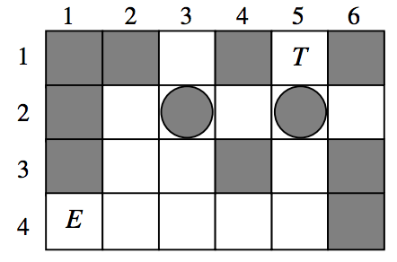
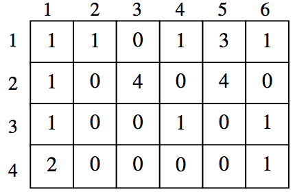

## 문제

A treasure hunter got a map of an ancient pyramid where the sacred treasure is enshrined. He started on a journey to excavate the treasure. Once he arrived at the gate of the pyramid, the earthquake occurred. As a result, some rocks fell from the ceiling to the floor on the inner pyramid. He found two rocks blocked the way to the treasure. He couldn’t pull any rocks because they are too large and heavy. One thing he could do is to push a single rock moving one block forward. Now, he is going to reach to the treasure and pushing the rocks if necessary. If he will push a rock to a wrong direction, he cannot advance any more, thus he will have to give up the treasure.

In a map of Figure 1, white blocks represent open paths and black blocks represent barriers. Black circles represent rocks, and E and T represent the position of the entrance and the treasure, respectively. A person and rocks can move to a direction of north, east, west, and south. In order to push a rock, the forward and the backward blocks of the position of the rock should be both white. In Figure 1, the person on E can push the rock on (2, 3) to north or east. But, he cannot push it to west and south because he can’t move to the positions (2, 4) and (1, 3). If he will push it to east, he cannot push it to east any more because he cannot push two rocks at the same time. If he will push the rock on (2, 5) to north, the treasure will be broken down. In order to get the treasure, he has to push the rock on (2, 3) to north and then push the rock on (2, 5) to east. Notice that any rock cannot be moved outside the pyramid.

Figure 1

Figure 2

A map is represented by a matrix as Figure 2. In a matrix, 0, 1, 2, 3, and 4 represent an open path, a barrier, the entrance, the treasure, and a rock, respectively. The entrance, the treasure, and the rocks are positioned on open paths in the map.

Write a program for computing the minimum number of pushing rocks so as to reach to the treasure. For an example in Figure 1, the answer is 2. If there is a path to the treasure without pushing any rocks, the answer is 0. If there doesn’t exist a path, the answer is -1.

## 입력

Your program is to read from standard input. The input consists of T test cases. The number of test cases T is given in the first line of the input. Each test case starts with a line containing two integers n and m, the number of rows and the number of columns of a map, 2 ≤ n, m ≤ 50. Each of the following n lines contains m integers of 0, 1, 2, 3, or 4, they represent each row of the map, where 0, 1, 2, 3, and 4 represent an open path, a barrier, the entrance, the treasure, and a rock, respectively. There are exactly a single 2, a single 3, and two 4’s in the map. There is a single space between the integers.

## 출력

Your program is to write to standard output. Print exactly one line for each test case. Print the minimum number of pushing rocks if they can get to the treasure. Otherwise, print -1.

The following shows sample input and output for three test cases.
