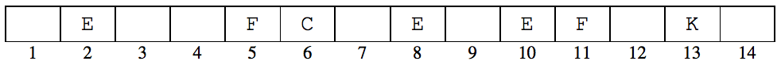
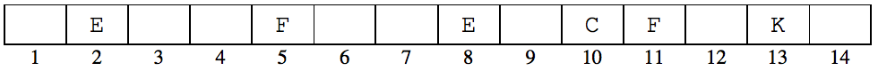

## 문제

A game called janggi is a variant of chess played in Korea. It is played by two players on a board with 9 × 10 size. Each player has 16 pieces of 7 kinds — 1 king, 2 chariots, 2 cannons, 2 horses, 2 elephants, 2 guards and 5 pawns. In janggi, the cannon’s move has several restrictions. The cannon moves and captures the opponent’s piece by jumping over exactly one piece along a straight line.

Here you are to write a program for the one-dimensional janggi. The board consists of linear cells. Four kinds of pieces are given: C (cannon), E (enemy), F (friend) and K (king). C and F are your pieces, and E and K are the opponent’s ones. Only one C and one K are given. Your have to capture K using a sequence of valid moves.

The rules of one-dimensional janggi are:

1. You can move only C.
2. C can move by jumping over exactly one piece of K, E or F.
3. The next position of C is either an unoccupied position or a position occupied by opponent’s pieces.
4. When C moves to a position occupied by an opponent’s piece, we say “C captures E (or K)” and the captured piece is removed from the board. Obviously C can not capture a friendly piece, F.
5. The game is over when C captures K.

For example, in the following board, C is in position 6. In this position, C can move to 2 (by capturing E), 3, 4, 9 or 10 (by capturing E). Other positions are not reachable by a single move.

After C captures E in 10, the board changes as follows. Now C can move to 6, 7, 12 or 13 (by capturing K)

## 입력

Your program is to read from standard input. The input consists of T test cases. The number of test cases T is given in the first line of the input. Each test case takes one line containing a string which represents the configuration of the one-dimensional janggi board. Occupied cells are denoted by C, E, F and K; and unoccupied cells are denoted by B. The length of the string is at least 5 and at most 200.

## 출력

Your program is to write to standard output. Print exactly one line for each test case. For each test case, print the minimum number of moves to capture K. If it is impossible to capture K, print 0.

The following shows sample input and output for three test cases.
