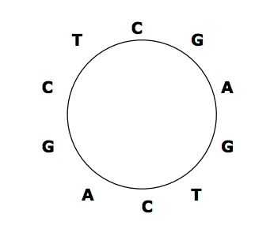

## 문제

Some DNA sequences exist in circular forms as in the following figure, which shows a circular sequence `CGAGTCAGCT`, that is, the last symbol `T` in `CGAGTCAGCT` is connected to the first symbol `C`. We always read a circular sequence in the clockwise direction.

Since it is not easy to store a circular sequence in a computer as it is, we decided to store it as a linear sequence. However, there can be many linear sequences that are obtained from a circular sequence by cutting any place of the circular sequence. Hence, we also decided to store the linear sequence that is lexicographically smallest among all linear sequences that can be obtained from a circular sequence.

Your task is to find the lexicographically smallest sequence from a given circular sequence. For the example in the figure, the lexicographically smallest sequence is `AGCTCGAGTC`. If there are two or more linear sequences that are lexicographically smallest, you are to find any one of them (in fact, they are the same).

## 입력

The input consists of T test cases. The number of test cases T is given on the first line of the input file. Each test case takes one line containing a circular sequence that is written as an arbitrary linear sequence. Since the circular sequences are DNA sequences, only four symbols, `A`, `C`, `G` and `T`, are allowed. Each sequence has length at least 2 and at most 100.

## 출력

Print exactly one line for each test case. The line is to contain the lexicographically smallest sequence for the test case.
