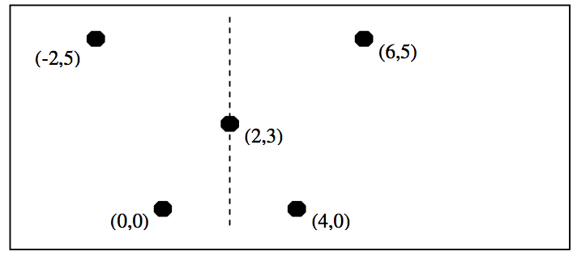
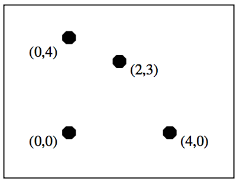

## 문제

The figure shown on the left is left-right symmetric as it is possible to fold the sheet of paper along a vertical line, drawn as a dashed line, and to cut the figure into two identical halves. The figure on the right is not left-right symmetric as it is impossible to find such a vertical line.

Write a program that determines whether a figure, drawn with dots, is left-right symmetric or not. The dots are all distinct.

## 입력

The input consists of T test cases. The number of test cases T is given in the first line of the input file. The first line of each test case contains an integer N , where N(1 ≤ N ≤ 1,000) is the number of dots in a figure. Each of the following N lines contains the x-coordinate and y-coordinate of a dot. Both x-coordinates and y-coordinates are integers between –10,000 and 10,000, both inclusive.

## 출력

Print exactly one line for each test case. The line should contain YES if the figure is left-right symmetric, and NO, otherwise.

The following shows sample input and output for three test case.
