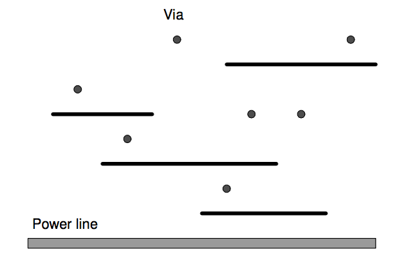
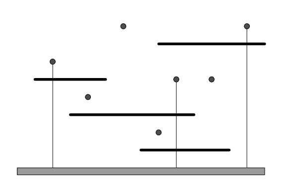

## 문제

A digital logic circuit in a printed circuit board (PCB) consists of a collection of interconnected parts which are usually integrated circuit (IC) chips. Each IC chip has several pins to be interconnected by wires to other pins in another IC chip or a power line. Most PCBs are built as a stack of several layers. Wiring pattern in each layer consists of wires presumed to be horizontal or vertical. In a multilayered PCB board, layers are connected together through drilled holes, called vias, forming conductive paths between layers.

While designing of a complex PCB board, a special layer is to be designed for the power supply. The special layer has the following properties:

1. A horizontal power line is to be fixed on the bottom of the layer.
2. A number of horizontal wires are given in advance.
3. There are several vias on the layer.
4. Every horizontal wire is to be connected to the power line with vertical wires. The vertical wires must start at the power line, intersect several horizontal wires to supply power to them and stop at a via.

To have a cost-effective PCB design, we are going to minimize the number of vertical wires connected to a power line in this special layer.

In the following figure (a), there are four horizontal wires and seven vias on a special layer. Then the minimum of vertical wires to supply power to every horizontal wire is three. Figure (b) shows one example of layouts of three vertical wires. Note that a horizontal wire can intersect more than one vertical wire to supply power.

(a)

(b)

Given a set of horizontal wires and a set of vias, write a program computing the minimum number of vertical wires connecting a power line and all the horizontal wires.

## 입력

The input consists of T test cases. The number of test cases T is given in the first line of the input file. Each test case starts with a line containing two integers M N (1 ≤ M , N ≤ 100) , where the first integer M is the number horizontal wires and the second integer N is the number of vias. In the following M lines from the second, the coordinates of end points of horizontal wires are given. Three integers p q r are given in each line, where the first integer p (1 ≤ p ≤ 10,000) is the y -coordinate of a horizontal wire, and the second and the third integers q r (1 ≤ q < r ≤ 10,000) are the x -coordinates of the left and right end points of the same horizontal wire, respectively. The horizontal wires do not intersect each other. In the following N lines, the coordinates of vias are given. In each line, two integers s t (1 ≤ s,t ≤ 10,000) are given in each line, where s, t are x -, y -coordinates of a via, respectively. Note that there is at most one via on the same vertical line and vias are not on horizontal wires. You may assume that the power line is positioned on the x -coordinate axis.

## 출력

Print exactly one line for each test case. The line should contain an integer that is the minimum number of vertical wires connecting a power line and all the horizontal wires. If every horizontal wire cannot be connected with at least one vertical wire, print IMPOSSIBLE in the line.

The following shows sample input and output for three test cases.
