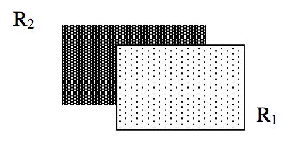
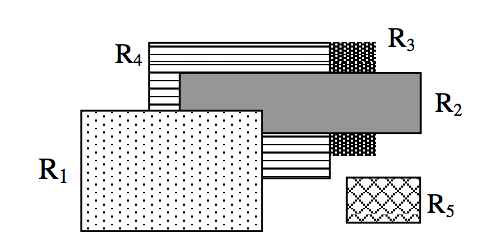
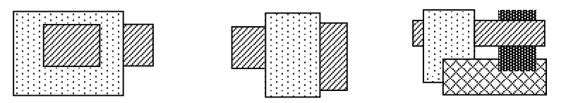

## 문제

Taking a picture of objects gives an image. Though the image depicts the objects, some information about the object space may disappear in the image. It is interesting and sometimes challenging to reconstruct the information that has disappeared in the image.

We assume the following scenario:  
[A1] We obtain an image by taking a picture of rectangles, from z = -∞, whose sides are parallel to the x-axis or the y-axis and whose faces are parallel to the xy-plane.  
[A2] The z-coordinates of rectangles in the object space are all different. We assume the depth order of rectangles is numbered from 1 to n, where the uppermost one (with the smallest z-coordinate) has the order of 1.

Depth information (that is, the z-coordinate) of each rectangle does not exist in the image but we can sometimes infer which one is above the other between two rectangles (of course sometimes we cannot conclude.) For example it is easily inferred from Figure 1 that the dotted rectangle R1 is above the dark rectangle R2. In this case we say that “R1 is above R2” and “R2 is below R1”. Under the assumption of [A2], depth order of R1 is 1 and that of R2 is 2.

Figure 1

Because of [A1], such above/below relation is transitive (that is, if R1 is above R2 and R2 is above R3 then we can conclude R1 is above R3.) In the example of Figure 2, we can conclude that the dotted rectangle R1 is above the dark rectangle R3 because the gray rectangle R2 is above R3 and R1 is above R2. On the other hand no information is available about the lower right rectangle R5. In such a case we say that the depth order between R5 and any other rectangle is not inferable. Analogously, the depth order between the dark rectangle R3 and the rectangle R4 (filled with horizontal lines) is not inferable. Under the assumption of [A2], depth order of R1 is 1 or 2; that of R2 is 2 or 3; that of R3 is 3, 4, or 5; that of R4 is 3, 4, or 5; that of R5 is from 1 to 5.

Figure 2

Notice that not all images are valid. Figure 3 shows examples of “impossible” images that we cannot obtain under the assumptions of [A1] and [A2].

Figure 3

The problem is as follows: we are given an image and additionally a rectangle α. Your program reports IMPOSSIBLE in case that the image is not obtainable under the assumptions of [A1] and [A2]. Otherwise your program must output two integers β and γ (β≤γ), where the maximum possible range of depth order of α is (β, β+1, …, γ).

## 입력

The input consists of T test cases. The number of test cases T is given in the first line of the input file. The first line of each test case contains three integers N, NX, NY (2 ≤ N ≤ 52; 2 ≤ NX, NY ≤ 80) separated by blanks, where n denotes the number of rectangles and NX and NY denote the width and the height of the image respectively. The next NX lines give NX × NY pixels, separated by a blank, each of which is either the “dollar” symbol (denoted by ‘\$’) representing the background or an alphabet character in {‘a’, ‘b’, …,`z’, ‘A’, ‘B’, …, ‘Z’} representing rectangles. We distinguish uppercase letters from lowercase letters. Note that the smallest rectangle can be as small as 1 × 1. The last line of each test case gives an alphabet letter α, which denotes the rectangle of which we want to output the maximum possible range of depth order.

## 출력

For each test case, your program is to report IMPOSSIBLE if this image is not obtainable under the assumptions of [A1] and [A2]. Otherwise your program is to report β and γ (β≤γ), separated by a blank, where the maximum possible range of depth order of α is (β, β+1, …, γ).

The following sample input and corresponding correct output represent three test cases, each of which encodes Figure 1, Figure 2, and the leftmost one in Figure 3, respectively.
