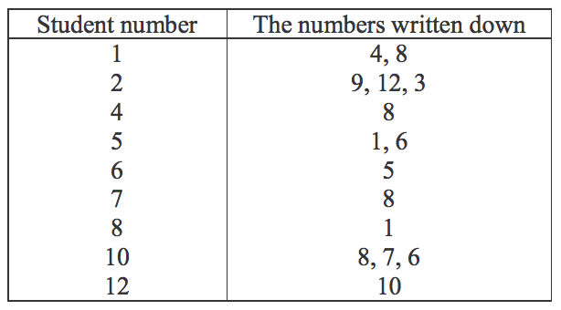

## 문제

The students in Kim's class did a popularity vote to determine who were popular in the class. Each student was asked to write down the ID numbers of at most three students, except himself/herself, whom he or she liked.

After the vote was over and popular students were chosen, Kim, looking at the vote result, was curious to solve the following math question: What was the largest core?

A set of students is called a core if every student in the set

l voted,  
l liked some students in it but no one outside it, and  
l was liked by some one in it.

More formally, each student will be represented by his or her student ID number from 2,1{ ,...,N}, where the class has N students. For example, the table below shows the result of a vote by 12 students in Kim's class.

Students 3, 9, and 11 were absent from school and did not vote, so they do not appear in the left column of the table.

Kim found the set {1, 4, 5, 6, 8} to be a core; every student in it voted, liked some students in it but not outside it, and was liked by some one in it. More specifically, 1 liked {4, 8}, 4 liked {8}, 5 liked {1, 6}, 6 liked {5}, and 8 liked {1}. They collectively liked {4, 8, 1, 6, 5}, which are themselves. The number of students in this set is five. {1, 4, 8} is also a core, but it is smaller. As a matter of fact, no core with six or more students is possible from the table. Thus, the size of the largest core of the vote result above is five.

Write a program to find the size of the largest core of a vote result.

## 입력

The input consists of T test cases. The number of test cases ( T ) is given on the first line of the input file. The first line of each test case contains two integers N and M , where N (1 ≤ N ≤10,000) is the number of students in the class, and M is the number of students who voted. Each of the following M lines is to begin with an integer i representing a student ID number in {1, 2, ..., N}, which is to be followed by an integer Ni(1 ≤ Ni ≤ 3) representing the number of students written down by student i , which is to be followed in turn by a sequence of Niintegers representing the ID numbers written down by student i .

## 출력

Print exactly one line for each test case. The line is to contain an integer that is the size of the largest core. The following shows sample input and output for two test cases.
