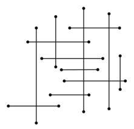

## 문제

명우는 픽업 게임을 하려고 한다. 규칙은 다음과 같다.

1. 아래 그림과 같은 가로, 세로 선이 여러 개 있다.
2. 선분의 교점을 클릭하면 교점을 이루는 두 선분을 집어갈 수 있다. (집어가면 두 선분은 사라진다)
3. 모든 선분은 무게가 있다.
4. 무게가 a와 b인 선분을 집어갈 때, 얻는 점수는 a × b이다.

게임의 첫 번째 목표는 최대한 많은 선분을 집어가는 것이다. 두 번째 목표는 최대한 많은 점수를 얻는 것이다. 즉, 선분을 많이 집어가는 방법이 여러 가지라면, 점수를 최대로 하는 방법으로 집어가야 한다.

게임의 정보가 주어졌을 때, 집을 수 있는 선분의 최대 개수와, 최대 점수를 구하는 프로그램을 작성하시오.

## 입력

첫째 줄에 테스트 케이스의 개수 T가 주어진다. 각 테스트 케이스의 첫째 줄에는 가로 선의 수 n과 세로 선의 수 m이 주어진다. (1 ≤ n,m ≤ 200) 다음 n개 줄에는 각 가로 선의 정보 x,y,x',y',w가 주어진다. (x,y)와 (x',y')는 선분의 양 끝 점을 나타내고, w는 그 선분의 무게이다. (y = y') 다음 m개 줄에는 세로 선의 정보가 가로 선의 정보와 같은 형식으로 주어진다. 모든 좌표는 양수이고 100,000보다 작거나 같다. 또한, 무게도 양수이며 20보다 작거나 같다. 모든 선분 쌍은 최대 한 개의 점에서 만나며, 끝 점에서 만나는 경우는 없다.

## 출력

각 테스트 케이스마다 두 정수를 출력한다. 첫 정수는 집을 수 있는 선분의 쌍의 개수의 최댓값이고, 두 번째는 그 쌍의 개수만큼을 집어가면서 얻을 수 있는 최대 점수이다.
