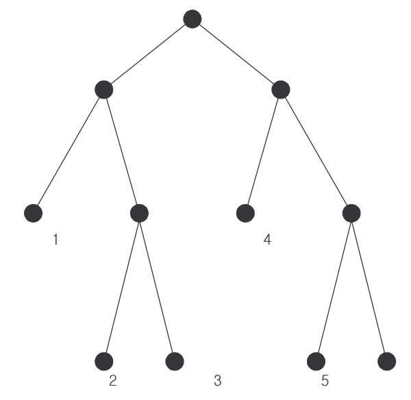

## 문제

The genealogy of a family can be represented as a rooted tree, in which each node corresponds to a member of the family, and each edge connects a member to his/her parent. The root is the founder of the family and has no parent in the genealogy; leaf nodes correspond to those with no child. The distance between two members in a genealogy is called a ChonSu in Korea, which is defined as the number of edges on the path between them. For example, in the genealogy shown below, the ChonSu between persons 1 and 3 is 3 while the ChonSu between persons 1 and 5 is 5. From now on, the ChonSu between person i and person j will be denoted by ChonSu (i, j) .

A rooted tree in which each node, unless it is a leaf node, has exactly two children is a 2-tree. In other words, a 2-tree is a binary tree in which each node has either two children or none. For example, the tree shown above is a 2-tree.

Consider a family whose complete genealogy is unknown. What is known about the genealogy of the family is that it is a 2-tree and it has n leaf nodes. Assume that the leaf nodes are numbered from 1, 2, …, n in the left-to-right order as shown in the figure above. Also known about the genealogy is the ChonSu between every pair of leaf nodes whose numbers are consecutive; i.e., ChonSu,(i, i+1) for every i (1 ≤ i ≤ n−1) is known.

It is well known that only from the information about the family given above, the ChonSu between any two leaf nodes can be computed.

You are to write a program to compute the ChonSu between two leaf members x, y (1 ≤ x < y ≤ n) given as an input.

For the example above, you are given as input, n = 6, ChonSu(1, 2) = 3, ChonSu(2, 3) = 2, ChonSu(3,4) = 5, ChonSu(4,5) = 3, and ChonSu(5,6) = 2. From this information, you can compute ChonSu(1,6), that is, the ChonSu between x =1 and y =6.

## 입력

The input consists of T test cases. The number of test cases ( T ) is given on the first line of the input file. The first line of each test case contains an integer n (3 ≤ n ≤ 1,000), the number of leaf nodes. The next line contains a sequence of n −1 integers which are ChonSu(1,2), ChonSu(2,3) , ..., ChonSu (n−1, n) . The last line of each test case contains two distinct integers x, y (1 ≤ x < y ≤ n) which are the numbers of the two leaf members between whom the ChonSu is to be computed.

## 출력

Print exactly one line for each test case. The line is to contain an integer that is the ChonSu between two leaf nodes. The following shows sample input and output for two test cases.
