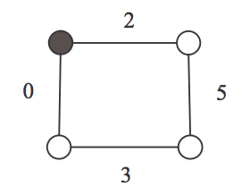
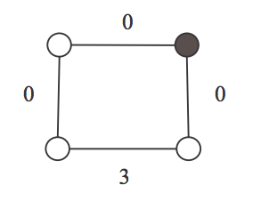
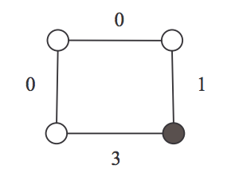
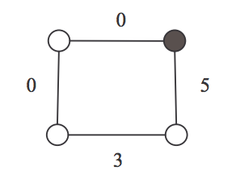

## 문제

Here is a game played on a cycle by two players. The rule of this game is as follows: At first, a cycle is given and each edge is assigned a non-negative integer. Among those integers, at least one is zero. Further a coin is put on a vertex of the cycle. From this vertex, the game starts and proceeds with two players’ alternating moves with the following series of choices:

1. Choose an edge incident with the vertex having the coin,
2. Decrease the value of this edge to any non-negative integer strictly,
3. Move the coin to the adjacent vertex along this edge.

The game ends when a player on his turn cannot move because the value of each edge incident with the vertex having the coin is equal to zero. Then, that player is the loser.

Figure 1 illustrates an actual game. In this game, Alice is the first player and Bob is the second player. In the starting position in Figure 1 (a), Alice cannot but choose the right edge of the vertex having the coin. Alice then decreases its value from 2 to 0, and moves the coin along this edge, which makes (a) into (b). Next, Bob cannot but choose the down edge of the vertex having the coin; he then decreases its value from 5 to 1, which makes (b) into (c). In Figure 1 (c), Alice chooses the up edge of the vertex having the coin and decreases its value from 1 to 0, which makes (c) into (d). Finally, in Figure 1 (d), Bob has no move since each edge incident with the vertex having the coin is assigned to zero. Then, Alice wins this game.

(a) Alice

(b) Bob

(c) Alice

(d) Bob

Figure 1: An example of cycle game (A coin is put on the black vertex)

In fact, whenever the game starts as shown in Figure 1 (a), the first player can always win for any second player’s move. In other words, in the starting position in Figure 1 (a), the first player has a winning strategy.

In this problem, you should determine whether or not the first player has a winning strategy from a given starting position.

## 입력

The input consists of T test cases. The number of test cases ( T ) is given on the first line of the input file. Each test case starts with a line containing an integer N (3 ≤ N ≤ 20), where N is the number of vertices in a cycle. On the next line, there are the N non-negative integers assigned to the edges of the cycle. The N integers are given in clockwise order starting from the vertex having the coin and they are separated by a single space. Note that at least one integer value among the N integers must be zero and that the value of no integer can be larger than 30.

## 출력

Print exactly one line for each test case. The line is to contain “YES” if the first player has a winning strategy from the starting position. Otherwise, the line is to contain “NO”. The following shows sample input and output for two test cases. The following shows sample input and output for two test cases.
