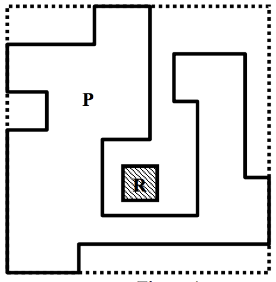
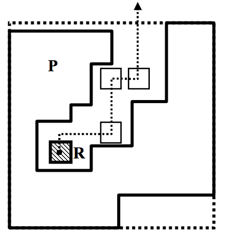

## 문제

We have a robot and an obstacle in a 2-dimensional plane. The robot is represented as a rectilinear square, and the obstacle as a rectilinear polygon. By rectilinear, we mean that the edges of a polygon are either horizontal or vertical. Initially, the robot is located outside the obstacle; that is, it does not intersect the boundary and is not in the interior of the obstacle. The robot wants to “escape” the obstacle by moving in horizontal or vertical directions without intersecting the obstacle. We say that the robot escapes the obstacle if it moves completely out of the smallest rectangle containing the obstacle (refer to Figure 1 and Figure 2). Note that the robot can be located outside of the smallest rectangle initially. You are to write a program for determining whether or not a robot can escape the obstacle.

In Figure 1 the robot cannot escape the obstacle, but in Figure 2 it can escape the obstacle; R represents a robot and P represents an obstacle. Let (x, y) be the coordinate of a vertex of P. Both x and y are multiples of 10 and 10 ≤ x, y ≤ 1,000,000. The length of an edge of R is a natural number less than 1,000,000, and its lowest digit is always 2, e.g., 2, 12, 22, 32, etc.

Figure 1

Figure 2

## 입력

The input consists of T test cases. The number of test cases ( T ) is given on the first line of the input file. The first line of each test case contains 3 integers nx, ny, and w (2 ≤ nx, ny, w ≤ 1,000,000), where (nx, ny) is the coordinate of the left-bottom corner of the robot R and w is the length of an edge of R with the lowest digit of w being fixed to 2. The second line contains an integer n (4 ≤ n ≤ 1,000), where n is the number of vertices of a rectilinear polygon P. The following n lines contain the coordinates of the vertices of P in counterclockwise order. Each line contains two integers nx and ny (10 ≤ nx, ny ≤ 1,000,000 and nx and ny are multiples of 10), where nx is the x-coordinate and ny is the y-coordinate of a vertex of P. A robot R is outside of P for every test case.

## 출력

For each test case, your program reports “YES” if the robot can escape the obstacle or “NO” otherwise. The following shows sample input and output for two test cases. The following shows sample input and output for two test cases.
