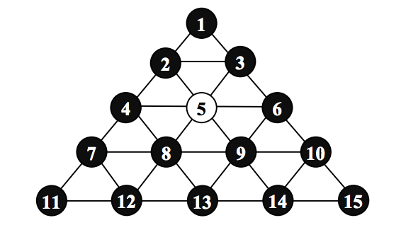

## 문제

Venture MFG Company, Inc. has made a game board. This game board has 15 holes and these holes are filled with pegs except one hole. A peg can jump over one or more consecutive pegs to the nearest empty hole along the straight line. As a peg jump over the pegs you remove them from the board. In the following figure , the peg at the hole number 12 or the peg at the hole number 14 can jump to the empty hole number 5. If the peg at the hole number 12 is moved then the peg at the hole number 8 is removed. Instead, if the peg at the hole number 14 is moved then the peg at the hole number 9 is removed.

Write a program which find a shortest sequence of moving pegs to leave the last peg in the hole that was initially empty. If such a sequence does not exist the program should write a message “IMPOSSIBLE”.

## 입력

The input consists of T test cases. The number of test cases ( T) is given in the first line of the input file. Each test case is a single integer which means an empty hole number.

## 출력

For each test case, the first line of the output file contains an integer which is the number of jumps in a shortest sequence of moving pegs. In the second line of the output file, print a sequence of peg movements. A peg movement consists of a pair of integers separated by a space. The first integer of the pair denotes the hole number of the peg that is moving, and the second integer denotes a destination (empty) hole number.
