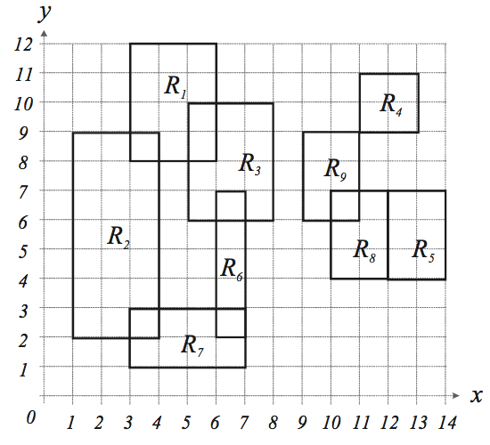

## 문제

You are given n axis-parallel rectangles on a plane. Here, an axis -parallel rectangle is a rectangle whose edges are parallel to either x -axis or y -axis. You are to find the number of colors to paint the given n rectangles according to the following rules:

1. 1. Each rectangle has to be painted with one color.
2. 2. A pair of intersecting rectangles must have the same color. Two rectangles are intersecting if their intersection is not empty when we regard a rectangle as a set of points including the boundary.
3. 3. A rectangle Ra must have the same color as Rb if there is a sequence of rectangles Ra= Ri1, Ri2, …,Rik= Rb such that Rijand Rij+1are intersecting for all 1≤ j < k ; otherwise, they must have different colors. For instance, rectangle R9 in the following figure must have the same color as R4, R5, R8, and have a different color from R1, R2, R3, R6, R7.

## 입력

The input consists of T test cases. The number of test cases (T) is given in the first line of the input file. Each test case begins with a line containing an integer N , 1≤ N ≤ 200 , that represents the number of rectangles in the test case. Each of the following N lines contains four positive integers x1 , y1 , x2 , and y2, 1 ≤ x1,y1,x2,y2 ≤ 10000 , representing a rectangle. (x1 ,y1) and (x2 , y2) are the (x, y) -coordinates of the lower - left and upper -right corners of the rectangle, respectively. The four integers are delimited by one or more spaces. From the N +3 -th line, the remaining test cases are listed in the same manner as above.

## 출력

The output should contain the number of colors, one per line.
