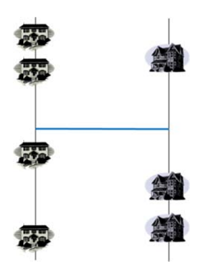

## 문제

도시의 북쪽에서 남쪽으로 흐르는 두 개의 강에 집이 그림처럼 각 강에 늘어서 있다. 여기에 양쪽의 각 집에 사는 사람들이 다른 곳으로 더 빨리 움직일 수 있게 하기 위해 다리를 놓을 생각이다.

왼쪽 강은 정확히 \(x = -1\)의 세로선이고, 오른쪽 강은 정확히 \(x=1\)의 세로선이다. 다리는 두 강의 각각의 지점을 연결하는 \(x\)-축에 평행한 선으로 표시되어 있다. 집의 위치가 세로선 위에 표시되어 있다.

다리의 최적 장소를 결정하기 위해 각각의 집이 \((-1, a\_{i})\) 혹은 \((1, b\_{j})\) (\(i=1,\cdots,n\), \(j=1,\cdots,m\))에 위치할 때,\[\sum\_{\forall i,j}d(a\_{i}, b\_{j}) = \sum\_{\forall i, j}\left(|a\_{i}-h| + 2 + |h - b\_{j}|\right)\]를 최소화하는 \(h\)에, 즉 (가능한) 왼쪽 집에서 오른쪽 집으로 가는 모든 거리의 합을 최소화하는 \(h\)에 다리를 놓는 것이 좋을 것이다. 이를 출력하는 프로그램을 작성하라.

## 입력

첫째 줄에 T가 주어진다. 이는 입력이 T개의 테스트 케이스로 구성된다는 의미이다. 각각의 테스트 케이스의 첫째 줄에 n과 m이 주어진다. (1 ≤ n, m ≤ 106) n은 왼쪽 강의 집 수를, m은 오른쪽 강의 집 수를 의미한다. 다음 n개의 줄에는 n개의 왼쪽 강의 집 위치인 ai가 주어지고, 그 다음 m개의 줄에는 m개의 오른쪽 강의 집 위치 bj가 주어진다. (|ai|, |bj| ≤ 107) 이 (n+m)개의 줄에 주어지는 집의 위치는 모두 다른 정수값이다.

## 출력

각각의 줄에 대해 문제의 조건을 만족하는 h를 소수점 한 자리까지 한 줄에 출력하라. 그런 h가 여러 개 존재한다면, 가장 작은 값을 출력하면 된다.
