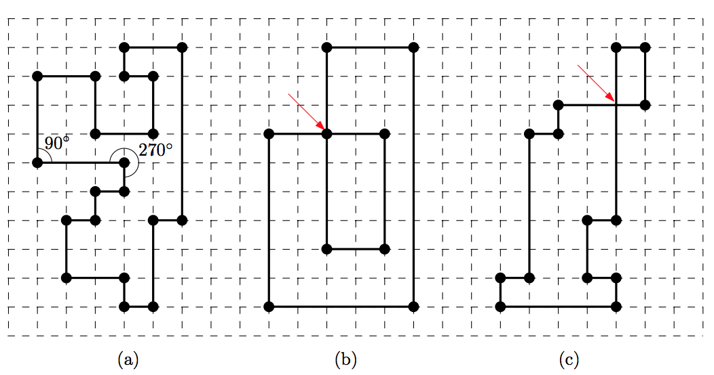
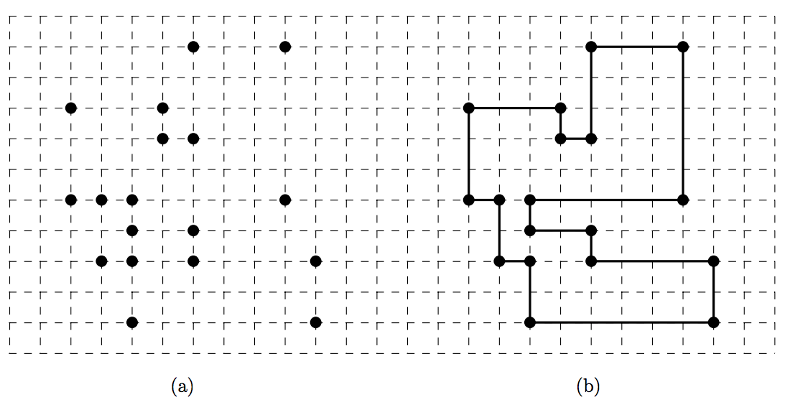

## 문제

A satellite sent us a photo of a ruin in the middle of some desert. The ruin in the photo turns out to an ancient castle of the forgotten kingdom which is 2000 years old. We also know that the floor plane of the castle has a shape of a rectilinear polygon.

A rectilinear polygon is a polygon whose edges are either horizontal or vertical. That is, at each vertex of the polygon, the interior angle formed by its two incident edges is either 90° or 270°, as shown in Figure 1. We say that a rectilinear polygon is simple if (1) each vertex is incident to exactly two edges and (2) there are no edges that intersect each other except at their end vertices.

Figure 1. (a) A simple rectilinear polygon. (b)-(c) Non-simple rectilinear polygons because (b) there is a vertex having four incident edges, or (c) there is a pair of edges crossing each other.

The current status of the castle we have figured out from the photo is not good. Only poles of the castle, i.e., the vertices of the simple rectilinear polygon, remained. Thus we need to find out how the poles were connected to recover the original shape of the castle. Figure 2 shows an example.

Formally, you are given a set of ݊ distinct points in the plane with integer coordinates. You need to decide whether or not we can reconstruct a simple rectilinear polygon by connecting all the points with horizontal and vertical segments alternatingly. You should output “YES” if it is possible to reconstruct a simple rectilinear polygon of ݊ vertices from the ݊ input points, “NO” otherwise.

Figure 2. (a) Input points. (b) A simple rectilinear polygon reconstructed from the input.

## 입력

Your program is to read from standard input. The input consists of T test cases. The number of test cases T is given in the first line of the input. Each test case starts with integer n, the number of points, where 4 ≤ n ≤ 10,000. Each of the following n lines contains two integers, representing x-coordinate and y-coordinate of the points between -106 and +106, inclusively. All the points are distinct.

## 출력

Your program is to write to standard output. Print exactly one line for each test case. The line should contain “YES” if the points form a simple rectilinear polygon, “NO” otherwise.
