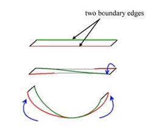
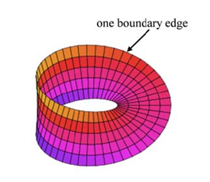

## 문제

The Möbius strip is a surface with only one side and only one boundary edge. Möbius strip can be created as follows Take a strip of paper and glue the ends together after twisting one end a half turn (see Figure 1).

Figure 1. Construction of a Möbius strip

Given a rectangular strip of paper with square grid pattern of size m × n (m ≤ n) on both sides of the strip, we can create a Möbius strip by joining the shorter ends of the strip together. The Möbius strip is said to be of size m × 2n. For example, Figure 2 shows a Möbius strip of size 5 × 100. The squares on the Möbius strip are said to be adjacent if they touch each other by a side (except a side on a boundary edge). Consider a small ant lying in a square of the Möbius strip. The ant travels around on the strip by always moving to an adjacent square from the current square. Note that the ant cannot move across the boundary edge of the Möbius strip. The distance between two square on Möbius strip is defined to be the smallest number of squares an ant moved, except the starting square, when an ant travels from a square to the other. Therefore the distance between two adjacent squares is 1.

Figure 2. Möbius strip of size 5 × 100

An average distance of Möbius strip of size m × 2n is defined to be the average distance between all pairs of squares (including all pairs of the same square) on the strip. For example, the average distance of Möbius strip of size 1 × 2n is n/2.

Give a size of Möbius strip, you should output the average distance of the strip.

## 입력

Your program is to read from standard input. The input consists of T test cases. The number of test cases T is given in the first line of the input. Each test case consists of a single line containing two integers, and m and n(1 ≤ m ≤ n ≤ 1,000,000), where the size of input Möbius strip is m × 2n.

## 출력

Your program is to write to standard output. Print exactly one line for each test case. The line should contain a real value, the average distance of the input Möbius strip; the output should have precision of exactly 1 digit after decimal point (You have to round to the nearest tenth, i.e., the first digit after decimal point).
