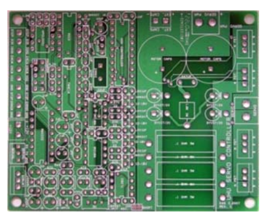
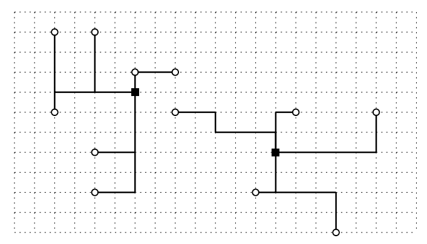

## 문제

A Printed Circuit Board (shortly, PCB) is used to electrically connect electrical components using conductive pathways (or wires) etched from copper sheets laminated onto a non-conductive substrate. Typical PCBs can be easily seen inside any personal computer, including a mainboard, a graphic card, and RAMs. For many reasons, a PCB should connect electrical components on it in a compact and efficient way, so how to wire each component to others is a central issue in designing PCBs.

International Circuit Production Corporation (shortly, ICPC), which is a company that manufactures PCBs on orders, recently received an order of designing a PCB, model code iCPC-2012, which will be installed in a next generation smart mobile device. According to the specification of iCPC-2012, it consists of N components C1, ..., CN and two special components, called clocks. A clock can send signals periodically to at most K (≥ N/2) components that are connected to it; that is, a clock can serve at most K components. Because all the N components in iCPC-2012 are required to be synchronized during their operations, each compoennt Ci has to be connected to one of the two clocks. The two clocks are supposed to be perfectly synchronized.

ICPC has so far decided the shape of the board of iCPC-2012 and the locations of each of the N components on it, but not where to put two clocks. In a viewpoint of synchronization among components, ICPC wants to minimize the minimum length of pathways from each component Ci to its connected clock. You are to write a program that computes the minimum possible length of the longest pathway between components and their connected clock when thw two clocks are optimally located.

More specifically, iCPC-2012 has the following properties.

1. Every pathway between a component and a clock consists of horizontal or vertical segments.
2. Every pathway runs under the components. So, you can freely design pathways, making them as short as possible.
3. The location pi = (xi, yi) of each component Ci is given as a pair of even integers, representing the coordinates on the board.
4. Each clock can be located at any place (x, y) on the board with -106 ≤ x, y ≤ 106. Clocks even can be located at the same location pi of component Ci.

Remark by (1) and (2) that the length of the pathway from ci to its connected clock is determined by the locations of the component and the clock; not by how to connect them.

An example is illustrated above, where N = 12 and K = 7. The locations pi of the 12 components are depicted as small circles and an optimal location of two clocks are marked as black squares. As shown above, the pathways, depicted by segments, fulfill (1) and (2), and the length of longest pathways is 7, which will be the correct answer of your program. Note that this optimal location of clocks is not unique.

## 입력

Your program is to read from standard input. The input consists of T test cases. The number T of test cases is given in the first line of the input. From the second line, each test case is given in order, consisting of the following: a test case contains two integers N (2 ≤ N ≤ 100,000) and K (N/2 ≤ K ≤ 100,000) in its first line, and is followed by N lines each of which consists of two even integers inclusively between -1,000,000 and 1,000,000, representing the x- and y-coordinates of pi = (xi, yi), the location of Ci on the board. Two consecutive integers in one line are separated by a single space and there is no empty line between two consecutive test cases.

## 출력

Your program is to write to standard output. Print exactly one line for each test case. The line should contain a single integer obtained by rounding off the minimum possible length of the longest pathway. For examples, if the result you obtain is 5.52, then you should print out “6”; if the result is 5.49, then you print out “5”.
