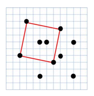

## 문제

평면 위에 N개의 점이 주어졌을 때, 가장 큰 정사각형의 넓이를 구하여라.

## 입력

첫째 줄에 테스트케이스의 개수 T가 주어진다.

각 테스트케이스의 첫째 줄에는 점의 개수 N(4 ≤ n ≤ 3,000)이 주어지고, 이어서 N개의 줄에는 점의 x좌표와 y좌표가 주어진다. 모든 좌표는 -10000 이상 +10000이하의 정수이다. 같은 위치의 점이 여러 번 주어지는 경우는 없다.

## 출력

각 테스트 케이스마다 가장 큰 정사각형의 넓이를 한 줄에 하나씩 출력한다. 단, 정사각형이 없는 경우 0을 출력한다.
