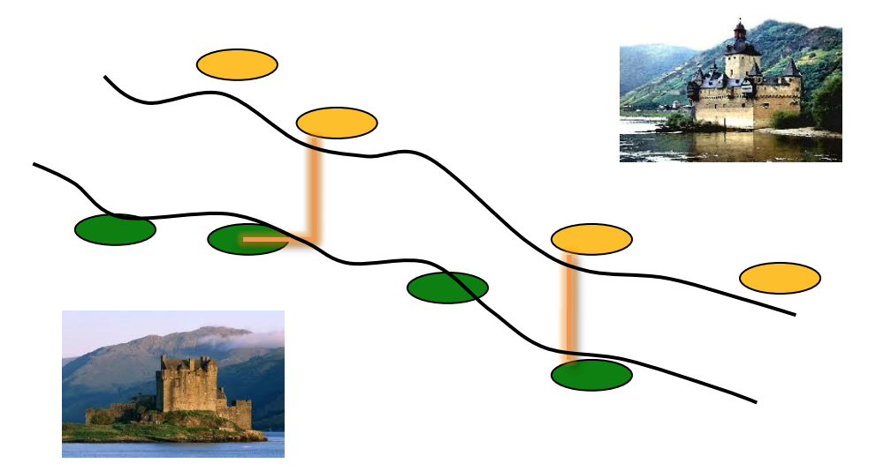

## 문제

The country ICPCIA has a river called “river of castles”. In the past, ICPCIA was divided into two kingdoms called Westeria and Eastania. Two kingdoms were separated by the river which runs in the direction from northwest to southeast. Both kingdoms had competitively built many castles for defense and attack along the riverside. All castles of each side of the river are located with an x-monotone increasing and y-monotone decreasing feature. In other words, let S = {s1, s2, … , sn} be the castles of Westeria and T = {t1, t2, … , tm} the castles of Eastania. Let (xi, yi) (resp. (ui, vi)) be the coordinates of si (resp. ti). Then xi < xj and yi > yj if i < j. Also, ui < uj and vi > vj if i < j.

Now, the Ministry of Culture and Tourism of ICPCIA decided to build a beautiful bridge connecting two castles on the opposite side of the river. The bridge will be an I-shape(a horizontal segment or a vertical segment) or an L-shape(both of a horizontal segment and a vertical segment). They want to find the location of the bridge such that its length is as small as possible. So, they try to find the closest pair of castles on the opposite side. The distance between two castles si and tj is computed by |xi - uj| + |yi - vj|.

Given the information of two sets of castles, write a program to find the distance between the closest castles on the opposite side of the river.

## 입력

Your program is to read from standard input. The input consists of T test cases. The number of test cases T is given in the first line of the input. Each test case consists of three lines. The first line of each test case contains two integers. The first integer, n, is the number of castles in the west side of the river, and the integer, m, is the number of castles in the east side of it, where 1 ≤ n, m ≤ 200,000. The second line of each test case contains 2n integers x1, y1, x2, y2, …, xn, yn , where (xi, yi) is the coordinate of the i-th castle in the west side of the river and xi < xj and yi > yj if i < j. The last line of each test case contains 2m integers u1, v1, u2, v2, …, um, vm , where (ui, vi) is the coordinate of the i-th castle in the east side of the river and ui < uj and vi > vj if i < j. You may assume that there exists an x-monotone increasing and y-monotone decreasing path which separates two sets of castles. All integers representing the coordinates of castles are between -109 and 109, inclusive.

## 출력

Your program is to write to standard output. Print exactly one line for each test case. The line should contain the distance between the closest castles on the opposite side of the river.
