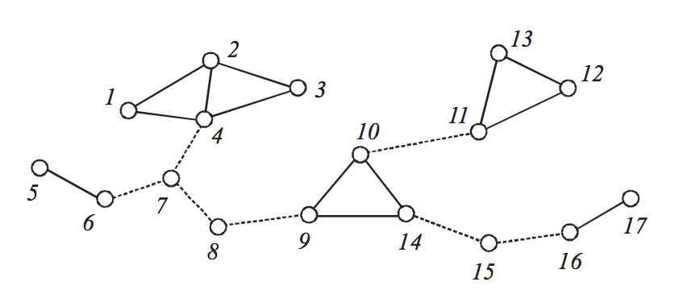

## 문제

The cube G3of a graph G = (V,E) is the graph on the vertex set V in which two vertices are joined by an edge if their distance in G is at most three, where the distance between two vertices in a graph is defined as the number of edges in a shortest path connecting them. A bridge (also known as a cut-edge) of a graph is an edge whose deletion increases the number of connected components. Equivalently, an edge is a bridge if and only if it is not contained in any cycle.

To study hamiltonian properties of the cubes of connected graphs, the following notions concerned with bridge were suggested in early 1960’s. A bridge of a graph G is said to be nontrivial if neither vertex incident with the edge is of degree one, where the degree of a vertex is the number of edges incident to it. See Figure 1.

* A vertex of G is called a pure bridge vertex if each edge incident to the vertex is a nontrivial bridge.
* A set of three distinct mutually adjacent vertices, each of degree at least three, is called a pure bridge triangle if each edge of G that is incident with exactly one of three vertices is a nontrivial bridge.

  
Figure 1. A connected graph which has seven nontrivial bridges represented by dotted lines. There are three pure bridge vertices 7, 8, and 15, one pure bridge triangle {9, 10, 14}, and one pure bridge pair {7, 8}.

It has been known that the cube of any connected graph G is hamiltonian-connected, i.e. every two vertices of G3are connected by a hamiltonian path. Recently, an ambitious research project on strong hamiltonian properties of graphs was initiated by Prof. Cho, who is a highly considered graph theorist. He introduced a new notion called pure bridge pair to characterize some interesting hamiltonian properties.

* A set of two adjacent vertices is called a pure bridge pair if both vertices are pure bridge vertices.

To support Prof. Cho’s research, you are to write an efficient running program to identify all the pure bridge vertices, pure bridge triangles, and pure bridge pairs in a large connected graph.

## 입력

Your program is to read from standard input. The input consists of T test cases. The number of test cases T is given in the first line of the input. The first line of each test case contains two positive integers. The first integer n is the number of vertices and the second integer m is the number of edges in an input graph G, where n ≤ 3,000 and m ≤ 1,000,000. In the following m lines, each line contains two integers u and v which means (u,v) is an edge of G. You may assume that G is connected and the vertex set of G is {1, 2, ..., n}.

## 출력

Your program is to write to standard output. Print exactly one line for each test case. The line should contain the numbers of pure bridge vertices, pure bridge triangles, and pure bridge pairs in sequence.
