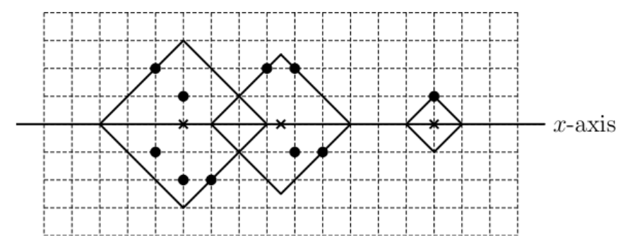

## 문제

Taeyeon has been using a rectangular carpet for a long time, thus the carpet has lots of indelible stains. Taeyeon decided to repair it by covering the stains with additional carpet patches. The shape of the patches is a diamond, which is a 45°- rotated axis-aligned square, as illustrated in Figure 1 below. The cost of a patch is proportional to its area. Taeyeon wants to minimize the total cost of the patches used to cover the stains, i.e., minimize the sum of area of the patches used. Moreover, Taeyeon is full of artistic sensitivity, so she wants some pattern of the patches. For this, she will align the centers of the patches on a line as illustrated in Figure 1. Patches can overlap each other.

  
Figure 1. Stains are black dots and the centers of the patches are the crosses. The thick line is the x-axis.

The figure above shows an example in which the nine stains can be covered by three patches with the minimum cost of 32.5(= 18+12.5+2).

The stains are given with integer coordinates. You should find a set of diamond-shape patches such that (1) every stain must be contained in the interior or on the boundary of some patch, (2) the centers of the patches must be on x-axis, and (3) the sum of area of the patches used must be minimized. You can assume that stains are all distinct and no stains lie on the x-axis.

## 입력

Your program is to read from standard input. The input consists of T test cases. The number of test cases T is given in the first line of the input. Each test case starts with integer n, the number of stains, where 1 ≤ n ≤ 10,000. Each of the following n lines contains two integers, representing x-coordinate and y-coordinate of the stains between -106 and +106, inclusive.

## 출력

Your program is to write to standard output. Print exactly one line for each test case. The line should contain a real value, the minimum area of the patches used to cover the stains; you output only 1 digit after decimal point, simply ignore the ones from the 2nd digit after decimal point.
