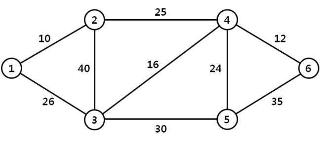

## 문제

We are given a graph which represents connections between nodes in the computer network, and the weight of an edge represents the bandwidth of a connection between two nodes. For the efficient data transmission between two nodes in the network, we are interested in finding a path between two nodes that has wide bandwidth. The bandwidth of a path is the minimum weight of an edge in the path. The widest path problem is to find the path between two nodes that has the maximum possible bandwidth.

For example, the widest path from node 1 to node 4 in Figure 1 has bandwidth 25, and passes through node 3 and node 2. The widest path from node 6 to node 3 has bandwidth 30, and passes through node 5.

  
Figure 1. Example of a computer network

Given two nodes in a graph, write a program which determines the bandwidth of the widest path between two nodes.

## 입력

Your program is to read from standard input. The input consists of T test cases. The number of test cases T is given in the first line of the input. Each test case starts with a line containing four integers n, m, s and t for a connected graph, where n (2 ≤ n ≤ 1,000) represents the number of nodes and m (1 ≤ m ≤ n(n-1)/2) represents the number of edges, s and t (s≠t) represents the two nodes(nodes are numbered from 1 to n). In the following m lines, the bandwidth of the edges are given; each line contains three integers, u, v, and b, where b (1 ≤ b ≤ 105) is the bandwidth of a connection between two nodes u and v.

## 출력

Your program is to write to standard output. Print exactly one line for each test case. The line should contain the bandwidth of the widest path between two nodes s and t.
