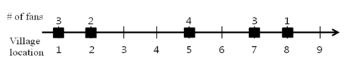

## 문제

The Motte Titans baseball team based in Vusan is planning for construction of a dome stadium. The city of Vusan is organized as N villages lined up in a straight highway. The Motte Titans has a survey data of the number of baseball fans for each village. The team wants to build a dome stadium in a village that minimizes the total distance from each baseball fan to the stadium.

Let each village’s location be represented by a coordinate on the x-axis. For example, there are 5 villages in Vusan on the x-coordinate (1, 2, 5, 7, 8) and their number of fans are (3, 2, 4, 3, 1). Then the dome stadium should be constructed in the village on the -coordinate 5 that minimizes the total distance from all the baseball fans to the stadium.

You are to program to find the location that minimizes the total distance from the each baseball fan to the stadium. The dome stadium should be constructed on a village in Vusan. Assume that every village is located on an integer x-coordinate.

## 입력

Your program is to read from standard input. The input consists of T test cases. The number of test cases T is given in the first line of the input. Each test case consists of three lines. The first line of each test case contains an integer N (1 < N ≤ 100,000) indicating the number of villages in Vusan. In the second line, N integers are given which represent the location of villages on the x-axis in ascending order. The range of the x-coordinates is from 1 to 100,000,000. In the third line, N positive integers are given which represent the number of baseball fans for each village. The range of the number of fans is from 1 to 10,000.

## 출력

Your program is to write to standard output. Print exactly one line for each test case. The line should contain an integer indicating the location of village that minimizes the total distance from the all baseball fans to the stadium. If there are multiple solutions, you should print the smallest x-coordinate for the location of the village.
