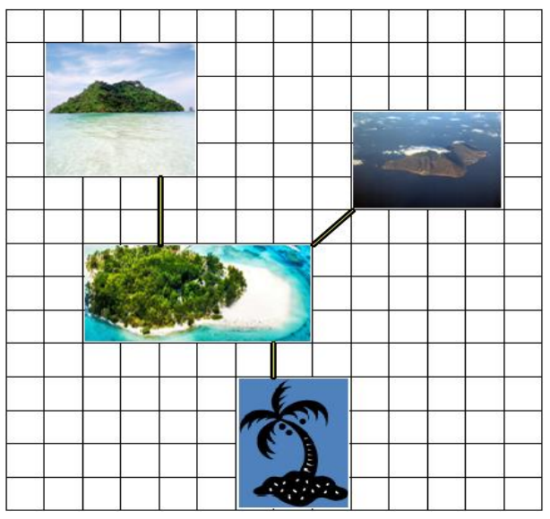

## 문제

Recently, there was a big typhoon that swept away all the bridges between islands. What’s done is done. Anyway, we need to deploy the road network again. As an emergency recovery, the government decided to construct bridges such that people would move between any pair of islands without getting wet. The cost of deploying a bridge of length x is the square of x. Due to land reclamation, all islands are rectangular and their boundaries are parallel to lines of latitude or lines of longitude. Given the positions and shapes of islands, compute the minimum cost of connecting all islands.

  
Figure 1. The illustration of the second sample input

## 입력

The input contains several test cases. The first line of the input contains an integer number 1 ≤ T ≤ 20 that indicates the number of test cases. In each test case, the first line is an integer 2 ≤ N ≤ 5,000 indicating the number of islands. Each line of next N lines contains four positive integers 0 ≤ x, y, w, h ≤ 10,000 where x and y is the x and y coordinates of upper-left corner of the island, and w and h are the width and height of the island, respectively.

## 출력

For each test case, output an integer indicating the minimum cost of the construction in the manner described above.
