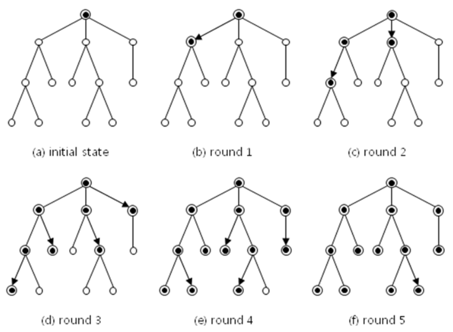

## 문제

Well renowned internet-based company ACM (Analog Computing Machinery) constructed a human network among employees to broadcast emergency messages from the chief executive officer (CEO) of the company. The emergency message from the CEO should be transmitted to all employees through the human network. The network is structured as a rooted tree where an employee of the company corresponds to one node of the tree and the CEO of the company corresponds to the root node. Initially the CEO, the root node, makes an emergency message. In a single round of time, any node that knows the emergency message can send the message to at most one of its children. We are going to compute the minimum number of rounds of time for the message from the CEO to be delivered to all employees of the company.

For example, the minim number of round is 5 when the rooted tree is structured as in Figure 1. Each directed edge in Figure 1 denotes a delivery of a message from one employee to another. Nodes marked with • denote employee who received the emergency message from the CEO of the company, including the CEO himself or herself.

  
Figure 1. An emergency message from the root node being broadcasted through a rooted tree in five rounds.

Given a rooted tree structure, write a program to compute the minimum number of rounds of time required for the emergency message from the root node of the tree to be delivered to all nodes.

## 입력

Your program is to read from standard input. The input consists of T test cases. The number of test cases T is given in the first line of the input. The first line of each test case contains an integer n (1 ≤ n ≤ 5,000) which is the number of nodes in the rooted tree. Each node is numbered from 1 to n, where 1 is assigned to the root node. The following n lines for each test case contain a list of child nodes for a node. In each line there are at least two numbers m k c1 c2 … ck (1 ≤ m ≤ n , 0 ≤ k ≤ n), where m denotes some node in the tree, k denotes the number of child nodes of the node numbered m, and c1 c2 … ck is the k child nodes of the node m.

## 출력

Your program is to write to standard output. Print exactly one line for each test case. The line should contain the minimum number of rounds required to broadcast the emergency message from the root node to all nodes.
