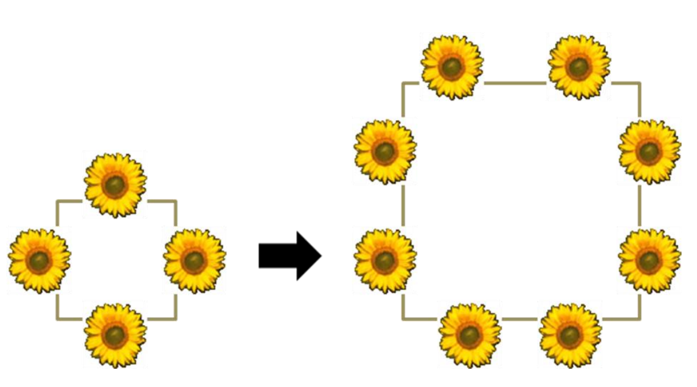

## 문제

  
그림 1. 첫 번째 sample input 에 대한 예시

소싯적 고향을 떠나 큰 성공을 거둔 A 씨는 은퇴를 고려하고 있다. 그는 꽃나무로 울타리를 친 집에서 살고 싶어서, 한 설계회사에 집 설계를 의뢰하였다. 그는 설계도를 보고 크게 만족했지만, 마당이 더 넓었으면 좋겠다고 생각했다. A 씨는 꽃 담장을 만들 나무를 팔아주기로 자신과 계약한 업체에 설계도를 보여주면서, 이 설계도와 모양은 같지만, 울타리 안쪽으로 들어올 땅 넓이는 아마도 더 넓어질 것이라고 이야기했다. 이 설계도에 나타난 울타리는 안쪽으로 오목하게 들어간 부분이 없다. 설계도의 울타리 모양은 마을 뒷산에 올라가서 내려다보면 보기 좋을 모양이기 때문에, 울타리의 각 변의 길이들의 비율이나 인접한 두 변이 이루는 각도가 변하면 안 된다. 꽃 울타리를 만들기 위한 공사비는 울타리의 길이에 비례한다. 울타리 안쪽 땅 넓이가 바뀌면 울타리 길이가 바뀐다. 따라서 계약해야 할 금액이 바뀌게 된다.

## 입력

입력은 표준입력(standard input)을 통해 받아들인다. 입력의 첫 줄에는 테스트 케이스의 개수 T (1 ≤ T ≤ 20)가 주어진다. 각 테스트케이스의 첫 줄에는 울타리로 감쌀 땅 넓이 x가 주어진다. 테스트 케이스의 둘째 줄부터 이 땅을 둘러 감쌀 울타리의 모양이 주어진다. 테스트 케이스의 둘째 줄에는 울타리의 방향이 꺾이는 곳의 숫자 N (3 ≤ N ≤ 10,000)이 주어진다. 이후 N 줄에 걸쳐, 울타리의 방향이 꺾이는 점들의 x좌표와 y좌표가 공백문자로 구분되어 한 줄에 하나씩 시계방향, 혹은 반시계방향 순서대로 주어진다. 점들의 좌표와 넓이는 실수로 주어지며, 길이의 단위는 m, 넓이의 단위는 m2이다.

## 출력

출력은 표준출력(standard output)을 통하여 출력한다. 각 테스트 케이스에 대하여 한 줄에 하나씩, 넓이가 x인 공간을 주어진 모양의 울타리로 둘러칠 때, 울타리의 길이를 m단위로 출력하라.

상대 오차가 0.01%미만인 경우, 정답으로 인정한다.
